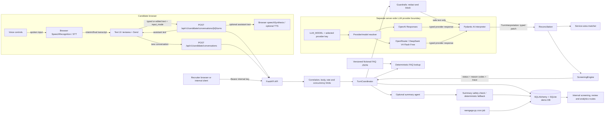

# AI Candidate Screening Assistant

An evaluator-ready reference implementation of a disclosed, bilingual (Spanish/English) chat flow for a fictional restaurant delivery-driver role. It demonstrates a useful boundary for applied AI in a sensitive workflow:

> The model interprets a candidate’s latest message into a typed fact patch. Python owns state reconciliation, service-area matching, eligibility rules, persistence, retries, and the recruiter handoff.

The repository is a modular monolith rather than a complete hiring product. It is intentionally designed to be inspectable: a reviewer can replay the same canonical state and ruleset without calling an LLM, while still seeing where a provider would improve natural-language understanding.

## What problem this solves

Candidates often answer several screening questions in one message, change an earlier answer, switch languages, ask a practical question, or abandon a form halfway through. A brittle form loses context; an unconstrained chatbot can silently invent facts or make an opaque employment decision. This service keeps the conversation natural while making the consequential parts explicit and auditable.

The current flow collects only these job-related fields:

- full name;
- valid driver’s licence (yes/no);
- city and service area;
- availability (`full_time`, `part_time`, or `weekends`);
- preferred schedule (`morning`, `afternoon`, `evening`, or `flexible`);
- delivery experience in years and optional platforms; and
- possible start date or period.

`qualified` means that all of those explicit fields are present, the licence answer is yes, the location is a confirmed entry in the configured catalogue, and the candidate confirms the collected information. It does not mean “hired”, “ranked”, or “recommended”. A recruiter reviews terminal and uncertain cases.

## Demo in one minute

The browser candidate view is `/`; the recruiter view is `/recruiter`. Both are served by the same FastAPI application. The candidate page stores the opaque resume token in browser local storage so a demo can resume a conversation. The recruiter page asks for the separately configured internal API key.

The bundled catalogue and FAQ are fictional fixtures for demonstration. They include Madrid, Barcelona, Valencia, Sevilla, Málaga, and selected Mexico City, Guadalajara, and Monterrey areas; they are not a real employer’s coverage map, job description, pay policy, or hiring criteria. Every FAQ entry is marked `fictional_demo: true`. Replace both data files and have the criteria reviewed before any real use.

Without the selected provider key, the app can start, serve health checks, create conversations, and run deterministic evaluations, but a live candidate turn returns a safe temporary provider-unavailable response. That is deliberate: importing the app and exercising infrastructure must not require a provider credential. The same screening agent can use OpenAI or OpenRouter through configuration; provider selection never changes deterministic qualification rules.

### Browser voice mode

The candidate page offers optional browser voice input and read-aloud responses. The voice path is a convenience layer around the existing candidate chat; it is not a second screening workflow.

1. Select Español or English, then click Hablar / Speak. Approve microphone access when the browser asks. The page shows an interim transcript while the browser recognises speech.
2. Click Terminar / Finish, or wait for recognition to finish. The final transcript is placed in the normal textarea. It is an editable draft; correct names, numbers, locations, or anything else before clicking Enviar / Send. Voice input is never submitted automatically.
3. The reviewed text is sent as the usual `POST /api/v1/candidate/conversations/{conversation_id}/turns` request with `input_mode: "voice"`. Typed text uses the same endpoint and state machine with `input_mode: "text"`; guardrails, reconciliation, rules, persistence, idempotency, and recruiter review are shared.
4. Check Leer respuestas en voz alta / Read replies aloud if you want the browser `speechSynthesis` API to read returned assistant replies while screening is active. Stop audio / Parar audio cancels playback. The written assistant response remains the source of truth and is always shown in the chat, including the terminal message.
5. Cancel / Cancelar abandons the current recognition attempt and keeps the chat usable. Stop / Opt out exits the screening through the same text command path. You can always continue by typing.

Web Speech support varies by browser and operating system. Chromium-family browsers such as current Chrome and Edge commonly expose `SpeechRecognition` (sometimes only the `webkitSpeechRecognition` name), but availability, language quality, permission behaviour, and server-side processing are browser/vendor choices. Safari, Firefox, embedded webviews, and managed devices may not expose recognition or may behave differently. If recognition is unavailable, the microphone control is disabled and the textarea/send flow remains fully available. `speechSynthesis` voice lists also vary; the page requests an `es-ES` or `en-US` locale and uses a matching installed voice when one exists.

Microphone access generally requires a secure context (`https://`) or `http://localhost`/loopback during local development, plus a browser permission. A denied permission, blocked site setting, missing microphone, browser privacy setting, network/provider problem, or unsupported API produces an actionable status and does not prevent typed input. For a local demo, open the port-8001 URL shown by the setup instructions directly rather than an insecure remote host.

The language selector controls the recognition and read-aloud locale for the next interaction and the conversation’s preferred language. Short code-switches may be detected, but mixed Spanish/English speech is not guaranteed to be transcribed or interpreted correctly; select the dominant language, speak one language at a time where possible, and review the draft. The same language-independent canonical facts and deterministic rules apply in either language.

The application receives the reviewed transcript text, not microphone audio, and has no audio table, media recorder, audio upload, or audio retention path. Browser speech recognition can nevertheless send audio or transcripts to a browser/vendor service, and browser/OS speech synthesis has its own processing and retention behaviour that this application cannot control or promise to keep local, EU-resident, or zero-retention. Do not dictate passwords, payment details, contact details, government IDs, or other unnecessary sensitive information. The page discloses this limitation and the normal server guardrails still inspect submitted text.

Troubleshooting: if the microphone is disabled, use a supported up-to-date browser on HTTPS/localhost and check the site’s microphone permission; if no words appear, wait for “Listening”, speak clearly, then use Finish or type instead; if the language is wrong, change the selector before starting a new attempt; if read-aloud is silent, check the checkbox, device volume, installed voices, and browser autoplay/privacy settings. Provider failures leave the written conversation available for a retry.

## Architecture



The request path is deliberately transactional around state, but not around provider latency:

1. Middleware assigns or validates `X-Correlation-ID`, enforces a body limit, applies process-local candidate rate limiting, and rejects excess turn concurrency.
2. The coordinator validates the message and idempotency key, inspects/redacts the message, reserves a turn, stores the redacted user message, and commits that reservation.
3. The interpreter receives only redacted text, trusted server dependencies, and bounded server-built history (six user/assistant pairs and 8,000 characters by default). It returns a strict `TurnInterpretation`; there is no status field in the model output.
4. Reconciliation applies only explicit typed facts. Existing values are not silently overwritten; corrections and contradictory values wait in `pending_confirmation`. Location text is resolved against the catalogue.
5. The pure screening engine computes the status, missing fields, reason codes, issues, ruleset version, and rule trace. The coordinator saves state with optimistic versioning and appends audit events.
6. For `qualified`, `disqualified`, or `needs_review`, summary generation happens after the state transaction. A provider summary is accepted only after schema and safety checks; otherwise a deterministic summary from canonical fields is stored.

## LLM boundary and deterministic boundary

| Concern | Owner | Contract |
| --- | --- | --- |
| Language detection and Spanish/English wording | LLM plus deterministic message templates | The LLM proposes `detected_language`, confidence, and intent. An explicit language switch may update session wording. |
| Extracting facts from natural language | LLM | Returns typed patches with bounded evidence, confidence, ambiguity, and correction flags. Only the latest message is evidence. |
| FAQ retrieval | Python | Accent-insensitive token/phrase matching over `data/faq/faq.json`; no free-form answer generation. |
| Location resolution | Python | Exact/alias matches are accepted; fuzzy suggestions require confirmation; ambiguous or unsupported text never selects an area. |
| Eligibility and terminal status | Python | `ScreeningEngine` evaluates only canonical `ScreeningState`; model output cannot set a status. |
| Corrections and confirmations | Python | `pending_confirmation` protects trusted values until the candidate says yes/no. |
| Safety and privacy | Python | Regex guardrails redact common email/phone/card/credential-like content and block prompt injection or sensitive-data messages before model work. |
| Recruiter summary | Optional LLM | Receives validated state and deterministic decision, not the transcript; output is bounded and checked, with a deterministic fallback. |

The model prompt also says not to infer protected characteristics, alter rules, invent service areas, or reveal internal instructions. That prompt is useful guidance, not a security boundary; the pre-model guardrail and deterministic code are the controls that matter.

## State and outcomes

The persisted canonical state is language-independent. The seven fields are processed in this order, skipping fields already present:

`full_name → drivers_license → location → availability → preferred_schedule → delivery_experience → start_availability → candidate confirmation`.

The screening status values are:

- `in_progress`: required information is missing, a location needs clarification, or a value is awaiting confirmation;
- `qualified`: every explicit criterion is satisfied and the candidate confirmed the review;
- `disqualified`: the candidate explicitly lacks a valid licence or is outside the configured service areas;
- `needs_review`: the bounded clarification or turn limit needs a human; and
- `abandoned`: the candidate opted out.

The separate conversation status is `active`, `completed`, or `opted_out`. A terminal screening result closes the conversation. A failed provider/storage turn keeps screening `in_progress` and leaves the last trusted state unchanged. See [`docs/process-design.md`](docs/process-design.md) for the full stage and edge-case contract.

## Repository map

| Path | Purpose |
| --- | --- |
| `src/candidate_screening/domain/` | Enums, canonical Pydantic state, service-area catalogue, pure rules and allowed transitions. |
| `src/candidate_screening/ai/` | Provider-neutral protocol, Pydantic AI adapter, strict extraction/summary schemas, and bounded history. |
| `src/candidate_screening/application/` | Coordinator, conversation controller, reconciliation, guardrails, FAQ, analytics, and re-engagement worker. |
| `src/candidate_screening/api/` | Versioned candidate, internal/recruiter, analytics, health, auth, middleware, and HTTP DTOs. |
| `src/candidate_screening/persistence/` | SQLAlchemy ORM, repositories, unit of work, and Alembic-compatible schema. |
| `data/` | Fictional service areas, FAQ, sample transcripts, scenarios, and evaluation cases. |
| `scripts/run_evals.py` | Network-free deterministic runner and explicit live-evaluation runner. |
| `scripts/reengage.py` | Dry-run-by-default bounded reminder job for inactive conversations. |
| `docs/` | Architecture, process, responsible-AI notes, sample conversations, and production roadmap. |

## Local setup

Prerequisites: Python 3.14, [PDM](https://pdm-project.org/), and a shell. Node.js 18+ is only needed for the dependency-free frontend test command. The lockfile is the source of truth for Python dependencies.

```bash
pdm install --dev --frozen-lockfile
cp .env.example .env
mkdir -p var
pdm run migrate
pdm run dev
```

Open <http://127.0.0.1:8001/> for the candidate view, <http://127.0.0.1:8001/recruiter> for the internal view, or <http://127.0.0.1:8001/docs> for FastAPI’s generated OpenAPI UI. Set the key for the provider selected by `LLM_MODEL` in `.env` for live turns. Never commit `.env`, provider keys, resume tokens, or candidate data.

Useful development commands:

```bash
pdm run test
node --test tests/frontend/*.test.mjs
pdm run lint
pdm run format
pdm run typecheck
pdm run pytest --cov=candidate_screening --cov-report=term-missing --cov-fail-under=85
pdm run pytest tests/test_rules_matrix.py --cov=candidate_screening.domain.rules --cov-branch --cov-report=term-missing --cov-fail-under=100
pdm run pytest tests/test_transitions.py --cov=candidate_screening.domain.transitions --cov-branch --cov-report=term-missing --cov-fail-under=100
pdm run pytest tests/test_service_areas.py --cov=candidate_screening.domain.service_areas --cov-branch --cov-report=term-missing --cov-fail-under=100
pdm run python scripts/run_evals.py --mode deterministic
# Optional, credentialed smoke test: uses only two bilingual cases.
pdm run python scripts/run_evals.py --mode live --json \
  --case-id happy_path --case-id english_happy_path
pdm run python scripts/reengage.py --dry-run
```

The deterministic evaluator is network-free and provider-free. It currently covers 20 fixture cases: Spanish and English happy paths, multi-field extraction, no licence, unsupported and ambiguous locations, opt-out, prompt injection and sensitive-data guardrails, corrections with confirmation or rejection, FAQ and off-topic interruptions, language switching, code-switching, duplicate answers, and provider/schema failures. A successful run reports `mode=deterministic passed=20/20 failed=0` (the JSON form is available with `--json`). These are regression fixtures, not evidence of production accuracy or fairness.

## Configuration

Copying `.env.example` supplies the main demo settings. Defaults below are loaded by `candidate_screening.config.Settings`; paths are relative to the working directory.

| Variable | Default | Used for |
| --- | --- | --- |
| `APP_ENV` | `development` | Environment label. |
| `LOG_LEVEL` | `INFO` | Application logging level. |
| `DATABASE_URL` | `sqlite+aiosqlite:///./var/screening.db` | Async SQLAlchemy database. |
| `LLM_MODEL` | `openai:gpt-5.6-luna` | Required `provider:model` selector. Use `openrouter:deepseek/deepseek-v4-flash:free` for the requested OpenRouter development route. |
| `OPENAI_API_KEY` | unset | Required only when an `openai:*` model is selected. |
| `OPENROUTER_API_KEY` | unset | Required only when an `openrouter:*` model is selected. The key is issued by OpenRouter. |
| `OPENROUTER_DATA_COLLECTION` | `deny` | Exclude downstream routes that declare non-transient data collection. This conservative setting can make a free route unavailable. |
| `OPENROUTER_ZDR` | `true` | Prefer zero-data-retention downstream routes. This may reduce availability. |
| `LLM_BASE_URL` | unset | Optional OpenAI-compatible base URL. |
| `LLM_TIMEOUT_SECONDS` | `15` | Provider timeout (1–120). |
| `LLM_MAX_RETRIES` | `2` | Pydantic AI retry budget (0–5). |
| `LLM_MAX_OUTPUT_TOKENS` | `800` | Extraction/summary output bound (64–4,000). |
| `INTERNAL_API_KEY` | unset | Bearer credential for recruiter/internal routes. |
| `SERVICE_AREAS_PATH` / `FAQ_PATH` | bundled JSON files | Data-driven catalogue and FAQ. |
| `INACTIVITY_HOURS` | `24` | Re-engagement eligibility threshold. |
| `RETENTION_DAYS` | `90` | Configuration placeholder for the retention job; deletion is not currently automated. |
| `MAX_INPUT_CHARACTERS` | `2,000` | Candidate message bound. |
| `MAX_TURNS` | `40` | Maximum screening turns; an unresolved final turn receives a deterministic recruiter handoff without another provider call. |
| `MAX_BODY_BYTES` | `32,000` | Request-body middleware bound. |
| `RATE_LIMIT_REQUESTS` / `RATE_LIMIT_WINDOW_SECONDS` | `60` / `60` | Per-process candidate request limiter. |
| `MAX_CONCURRENT_TURNS` | `16` | Per-process non-blocking turn semaphore. |
| `HISTORY_MAX_PAIRS` / `HISTORY_MAX_CHARACTERS` | `6` / `8,000` | Server-owned provider history bound. |

The in-process rate and concurrency controls are only a last line of defence for one worker. Put an edge/API gateway in front of a production deployment, and use a shared store for distributed limits.

### Choosing an LLM provider

`LLM_MODEL` is the single provider/model selector. The application constructs the same Pydantic AI extraction and summary agents for either provider:

```dotenv
# OpenAI (default)
LLM_MODEL=openai:gpt-5.6-luna
OPENAI_API_KEY=...

# Or OpenRouter's requested free development route
LLM_MODEL=openrouter:deepseek/deepseek-v4-flash:free
OPENROUTER_API_KEY=...
OPENROUTER_DATA_COLLECTION=deny
OPENROUTER_ZDR=true
```

Only the key for the selected provider is required. OpenRouter routing is deliberately configured with no model fallback and with required request parameters, so a failed free route returns a safe retryable response instead of silently using a paid model. The exact DeepSeek free slug is configurable and must be verified against OpenRouter's current availability before a live demo: free models have shared rate limits and may be temporarily unavailable. At the time of this implementation, OpenRouter's public endpoint record for this exact free slug reported no active endpoints, so an OpenRouter live smoke test may correctly fail with a safe provider-unavailable response until capacity is restored. The current model record is documented at [OpenRouter's DeepSeek V4 Flash page](https://openrouter.ai/deepseek/deepseek-v4-flash:free); downstream provider retention and data-use policies still require review before sending real candidate data.

## HTTP API quickstart

The canonical documented prefix is `/api/v1`. The candidate create endpoint is intentionally unauthenticated so it can issue a new opaque resume credential. All subsequent candidate reads and turns require that credential as a bearer token. Internal endpoints require the separate `INTERNAL_API_KEY`; a candidate resume token never authorizes recruiter access.

```bash
BASE=http://127.0.0.1:8001
CREATE=$(curl -sS -X POST "$BASE/api/v1/candidate/conversations" \
  -H 'Content-Type: application/json' \
  -d '{"language":"en","channel":"web"}')
CONVERSATION_ID=$(printf '%s' "$CREATE" | jq -r .conversation_id)
RESUME_TOKEN=$(printf '%s' "$CREATE" | jq -r .resume_token)

curl -sS "$BASE/api/v1/candidate/conversations/$CONVERSATION_ID" \
  -H "Authorization: Bearer $RESUME_TOKEN"

curl -sS -X POST "$BASE/api/v1/candidate/conversations/$CONVERSATION_ID/turns" \
  -H "Authorization: Bearer $RESUME_TOKEN" \
  -H 'Content-Type: application/json' \
  -H 'Idempotency-Key: demo-turn-001' \
  -d '{"message":"Ana López"}'
```

The turn key is required in either `Idempotency-Key` or the compatibility header `X-Idempotency-Key`; a body `idempotency_key` is also accepted. Replaying the same key and message returns the stored result with `idempotent: true`. Reusing it for a different message is a `409` error.

Candidate responses include `screening_status`, `assistant_message`, `state_version`, `next_field`, a deterministic `decision` when available, and `summary_status` for terminal outcomes. Errors use one shape—`{"error":{"code","message","correlation_id"}}`—and responses carry `X-Correlation-ID`. Common statuses are `401` (missing/invalid bearer), `409` (closed conversation, key reuse, or optimistic conflict), `413` (body/message too large), `422` (validation), `429` (rate/concurrency limit), and `503` (safe retryable provider/storage failure).

Internal examples:

```bash
export INTERNAL_API_KEY=change-me-for-local-demo
curl -sS "$BASE/api/v1/internal/screenings?status=needs_review&limit=100" \
  -H "Authorization: Bearer $INTERNAL_API_KEY"
curl -sS "$BASE/api/v1/internal/analytics" \
  -H "Authorization: Bearer $INTERNAL_API_KEY"
curl -sS -X POST "$BASE/api/v1/internal/screenings/SESSION_ID/reviews" \
  -H "Authorization: Bearer $INTERNAL_API_KEY" \
  -H 'Content-Type: application/json' \
  -d '{"reviewer_id":"recruiter-1","decision":"needs_review","notes":"Verify area"}'
```

`GET /api/v1/internal/analytics` is aggregate-only: it returns screening status counts, started/completed/in-progress/abandoned counts, qualified/disqualified/review counts, turn totals/failures, average latency, summary pending/generated/fallback counts, completion rate, ready handoffs, recorded-review count, audit `event_counts`, guardrail blocks, re-engagement sent/suppressed counters, average completed messages/turns, average screening duration, language distribution, FAQ usage, clarification retry counts, disqualification-reason distribution, and derivable drop-off-stage distribution. It does not return candidate transcripts or a ranking score.

Persisted averages use sessions whose status is `qualified`, `disqualified`, or `needs_review` (an explicit `completed_at` also qualifies a non-abandoned session). Average messages count user messages attached to completed turns, and average turns count turns with `status=completed`; both use the number of completed sessions as their denominator. Duration uses only valid non-negative `started_at`/`completed_at` pairs. Language counts include every session (`unknown` when absent), FAQ usage counts one answer per turn even when both legacy turn metadata and the dedicated audit event exist, clarification counts sum the persisted per-field counters, and disqualification reasons prefer the persisted result over a duplicate audit event. Drop-off stages count `in_progress` and `abandoned` sessions using their persisted current/next field and contain no message text or candidate identifiers.

Public operations endpoints are `/healthz`, `/livez`, and `/readyz`. The internal route aliases `/internal` and `/analytics`, and the candidate alias `/candidate`, remain for local compatibility but are omitted from OpenAPI; clients should use the versioned paths.

## FAQ, “RAG”, and knowledge boundaries

This demo does not have embeddings, a vector database, web search, or an open-ended retrieval-augmented-generation pipeline. Its deliberately small knowledge boundary is deterministic: `FAQCatalog` tokenizes and accent-folds the latest question, scores configured Spanish and English keywords/phrases, and returns the answer in the active language. A matched answer is prepended to the next screening prompt. An unsupported question receives a bounded “a recruiter can follow up” response and the flow continues. This makes answers reviewable and prevents the model from fabricating pay, policy, or job facts.

For a real FAQ, add ownership, effective dates, citations, retrieval tests, and a human-approved fallback before considering a semantic/vector retriever. See [`docs/future-production.md`](docs/future-production.md).

## Privacy, guardrails, and human oversight

The UI discloses that it is automated, explains the screening purpose, allows opt-out, and asks candidates not to share unrelated sensitive data. Before model work, the guardrail detects common prompt-injection phrases and credential/contact patterns, minimally redacts email addresses, phone numbers, card-shaped numbers, and terms such as password/API key/IBAN/NIF/NIE/CURP/RFC, then stores and forwards the redacted message. The request fingerprint for idempotency is a one-way hash of the submitted message. Resume tokens are returned once and only their SHA-256 hashes are stored.

Prompt-injection or sensitive-data turns do not mutate canonical screening facts or reach the model; the assistant stays on task. Provider failures return a retryable safe message and preserve the previous facts. Generated recruiter summaries are limited to validated state and a deterministic decision, reject prompt/PII/protected-attribute-like content, and fall back to a factual template. Audit events contain operational metadata rather than a candidate-ranking score. Recruiters can record `advance`, `reject`, `needs_review`, `qualified`, or `disqualified` reviews through the protected API.

This repository is an engineering demonstration, not a privacy notice, DPIA, employment policy, or legal opinion. It has no automated deletion worker, subject-rights workflow, consent/legal-basis configuration, tenant isolation, key rotation, production identity integration, or fairness evidence. Those are deployment requirements, not implied by the demo controls.

## Docker and deployment

The multi-stage `Dockerfile` uses Python 3.14, installs the frozen production lockfile, copies only runtime assets, runs as non-root user `app` (UID 10001), exposes port 8001, and includes a standard-library `/healthz` healthcheck. `docker/entrypoint.sh` runs `alembic upgrade head` and starts one Uvicorn worker. For a local container:

```bash
docker build --tag candidate-screening:local .
docker run --rm --env-file .env -p 8001:8001 \
  -v "$(pwd)/var:/app/var" candidate-screening:local
```

The included `render.yaml` describes a small Render Docker web service with one instance, a 1 GB disk mounted at `/app/var`, `/healthz` checks, and secrets supplied out of band. SQLite plus a single worker is a demo/development choice. For more than one instance, use a managed database (normally PostgreSQL), shared rate limiting, a queue for provider work, and an explicit migration/release process. Do not expose the internal key or provider key in image layers, logs, browser code, or URL query strings.

## CI and live evaluations

`.github/workflows/ci.yml` runs on pushes and pull requests: locked dev install, Ruff format check/lint, strict Pyright, pytest with coverage, migration smoke test, Docker build, and a `/healthz` container smoke test. `.github/workflows/live-evals.yml` is manual-only and supports the explicit `openai:gpt-5.6-luna` and `openrouter:deepseek/deepseek-v4-flash:free` choices. It requires only the secret for the selected provider, runs a small bilingual smoke subset, and validates a caller-supplied USD approval threshold of at most 5.00. That threshold is an operator approval gate only: the workflow and evaluator do not cap provider billing, so configure a provider/project quota separately before running live mode. OpenRouter's free quota and route availability are volatile; the workflow never substitutes another model. Live mode can incur provider cost and latency; deterministic mode is the default and should gate ordinary changes.

## EU orientation (checked 2026-09-02)

This is an engineering signpost, not legal advice or a classification of the demo. The European Commission’s [AI Act overview](https://digital-strategy.ec.europa.eu/en/policies/regulatory-framework-ai) and [enforcement timeline](https://digital-strategy.ec.europa.eu/en/policies/enforcement-ai-act), together with the [current consolidated Regulation (EU) 2024/1689](https://eur-lex.europa.eu/eli/reg/2024/1689), report broad application and enforcement/transparency activity from 2 August 2026 and Annex III employment high-risk rules from 2 December 2027 (with product-embedded high-risk rules from 2 August 2028). Recruitment classification depends on the concrete deployment and must be reviewed against the current sources. For data-protection orientation, see the official [GDPR text](https://eur-lex.europa.eu/eli/reg/2016/679/oj/eng/) and [EDPB rights overview](https://www.edpb.europa.eu/topics/key-gdpr-concepts/data-subject-rights_en). See [`docs/responsible-ai.md`](docs/responsible-ai.md) for the limitations and review gates.

## Design trade-offs

- A modular monolith keeps the domain boundary and transaction story visible; service extraction can wait until traffic or team boundaries justify it.
- SQLite makes local setup and deterministic tests cheap; it is not the right shared production store for concurrent, high-volume screening.
- A typed extraction patch is less flexible than letting a model emit a full reply, but it makes replay, validation, and rule ownership explicit.
- Conservative location matching creates clarifying turns and occasional recruiter review; that is preferable to silently accepting a fuzzy area.
- A lexical FAQ is less capable than semantic retrieval, but every answer is a versioned fixture and unsupported questions are honest.
- Post-transaction summaries avoid holding a database transaction open on provider latency; the trade-off is that terminal results briefly show `summary_status: pending` and may use a fallback. If the derived summary write fails, the protected internal `POST /api/v1/internal/screenings/{session_id}/summary/retry` endpoint can repair it without re-running screening.
- Process-local locks, limits, and rate counters are simple and testable; distributed deployments must add shared coordination.

## Further reading

- [`docs/architecture.md`](docs/architecture.md) — component/data model and request sequence.
- [`docs/process-design.md`](docs/process-design.md) — candidate journey, stages, and edge cases.
- [`docs/responsible-ai.md`](docs/responsible-ai.md) — controls, limitations, human review, and EU orientation.
- [`docs/sample-conversations.md`](docs/sample-conversations.md) — bilingual examples with structured states and outcomes.
- [`docs/future-production.md`](docs/future-production.md) — production-readiness backlog and decision gates.
- [`data/scenarios/scenarios.json`](data/scenarios/scenarios.json) and [`data/evals/eval_cases.json`](data/evals/eval_cases.json) — reviewable fixtures.

## License

Apache-2.0. See [`LICENSE`](LICENSE).
