# AI Candidate Screening Assistant

An evaluator-ready reference implementation of a disclosed, bilingual (Spanish/English) chat flow for a fictional restaurant delivery-driver role. It demonstrates a useful boundary for applied AI in a sensitive workflow:

> The model interprets a candidate’s latest message into a typed fact patch. Python owns state reconciliation, service-area matching, eligibility rules, persistence, retries, and the recruiter handoff.

The repository is a modular monolith rather than a complete hiring product. It is intentionally designed to be inspectable: a reviewer can replay the same canonical state and ruleset without calling an LLM, while normal safe candidate turns still ask the selected LLM first and use deterministic completion only when a valid structured response is neutral or empty.

## What problem this solves

Candidates often answer several screening questions in one message, change an earlier answer, switch languages, ask a practical question, or abandon a form halfway through. A brittle form loses context; an unconstrained chatbot can silently invent facts or make an opaque employment decision. This service keeps the conversation natural while making the consequential parts explicit and auditable.

The current flow collects only these job-related fields:

- full name;
- valid driver’s licence (yes/no);
- city and service area;
- availability (`full_time`, `part_time`, or `weekends`);
- preferred schedule (`morning`, `afternoon`, `evening`, or `flexible`);
- delivery experience in years and optional platforms; and
- possible start date or period.

Actionable relative periods such as “next week”, “next month”, and “as soon as possible” are valid start-period answers even without an exact calendar date. The interpreter preserves the candidate’s wording and records a typed precision (`week`, `month`, or `asap`); genuinely vague timing remains ambiguous and may require clarification. This is interpretation guidance, not a new eligibility rule: qualification still consumes only validated canonical state.

`qualified` means that all of those explicit fields are present, the licence answer is yes, the location is either a confirmed catalogue entry or an explicitly confirmed set of configured areas for a known city, and the candidate confirms the collected information. It does not mean “hired”, “ranked”, or “recommended”. A recruiter reviews terminal and uncertain cases.

## Demo in one minute

The browser candidate view is `/`; the recruiter view is `/recruiter`; and the aggregate analytics dashboard is `/analytics`. All are served by the same FastAPI application. The candidate page stores the opaque resume token in browser local storage so a demo can resume a conversation. The recruiter and analytics pages ask for the separately configured internal API key before loading protected data.

The bundled catalogue and FAQ are fictional fixtures for demonstration. They include Madrid, Barcelona, Valencia, Sevilla, Málaga, and selected Mexico City, Guadalajara, and Monterrey areas; they are not a real employer’s coverage map, job description, pay policy, or hiring criteria. Every FAQ entry is marked `fictional_demo: true`. Replace both data files and have the criteria reviewed before any real use.

Without the selected provider key, the app can start, serve health checks, create conversations, and run deterministic evaluations, but a normal live candidate turn returns a safe temporary provider-unavailable response. That is deliberate: importing the app and exercising infrastructure must not require a provider credential, and a missing key must not silently substitute another provider or semantic parser. Hard safety/control paths (guardrails, exact opt-out, explicit UI language events, and the turn limit) remain provider-free. The same screening agent can use the recommended Groq free development route, the secondary OpenRouter free route, or OpenAI through configuration; provider selection never changes deterministic qualification rules.

### Browser voice mode

The candidate page offers optional browser voice input and read-aloud responses. The voice path is a convenience layer around the existing candidate chat; it is not a second screening workflow.

1. Select Español or English, then click Hablar / Speak. Approve microphone access when the browser asks. The page shows an interim transcript while the browser recognises speech.
2. Click Terminar / Finish, or wait for recognition to finish. The final transcript is placed in the normal textarea. It is an editable draft; correct names, numbers, locations, or anything else before clicking Enviar / Send. Voice input is never submitted automatically.
3. The reviewed text is sent as the usual `POST /api/v1/candidate/conversations/{conversation_id}/turns` request with `input_mode: "voice"`. Typed text uses the same endpoint and state machine with `input_mode: "text"`; guardrails, reconciliation, rules, persistence, idempotency, and recruiter review are shared.
4. Check Leer respuestas en voz alta / Read replies aloud if you want the browser `speechSynthesis` API to read returned assistant replies while screening is active. Stop audio / Parar audio cancels playback. The written assistant response remains the source of truth and is always shown in the chat, including the terminal message.
5. Cancel / Cancelar abandons the current recognition attempt and keeps the chat usable. Stop / Opt out exits the screening through the same text command path. You can always continue by typing.

Web Speech support varies by browser and operating system. Chromium-family browsers such as current Chrome and Edge commonly expose `SpeechRecognition` (sometimes only the `webkitSpeechRecognition` name), but availability, language quality, permission behaviour, and server-side processing are browser/vendor choices. Safari, Firefox, embedded webviews, and managed devices may not expose recognition or may behave differently. If recognition is unavailable, the microphone control is disabled and the textarea/send flow remains fully available. `speechSynthesis` voice lists also vary; the page requests an `es-ES` or `en-US` locale and uses a matching installed voice when one exists.

Microphone access generally requires a secure context (`https://`) or `http://localhost`/loopback during local development, plus a browser permission. A denied permission, blocked site setting, missing microphone, browser privacy setting, network/provider problem, or unsupported API produces an actionable status and does not prevent typed input. For a local demo, open the port-8001 URL shown by the setup instructions directly rather than an insecure remote host.

The language selector controls the recognition and read-aloud locale for the next interaction and the conversation’s preferred language. Short code-switches may be detected, but mixed Spanish/English speech is not guaranteed to be transcribed or interpreted correctly; select the dominant language, speak one language at a time where possible, and review the draft. The same language-independent canonical facts and deterministic rules apply in either language.

The application receives the reviewed transcript text, not microphone audio, and has no audio table, media recorder, audio upload, or audio retention path. Browser speech recognition can nevertheless send audio or transcripts to a browser/vendor service, and browser/OS speech synthesis has its own processing and retention behaviour that this application cannot control or promise to keep local, EU-resident, or zero-retention. Do not dictate passwords, payment details, contact details, government IDs, or other unnecessary sensitive information. The page discloses this limitation and the normal server guardrails still inspect submitted text.

Troubleshooting: if the microphone is disabled, use a supported up-to-date browser on HTTPS/localhost and check the site’s microphone permission; if no words appear, wait for “Listening”, speak clearly, then use Finish or type instead; if the language is wrong, change the selector before starting a new attempt; if read-aloud is silent, check the checkbox, device volume, installed voices, and browser autoplay/privacy settings. Provider failures leave the written conversation available for a retry.

### Candidate chat experience

The candidate and recruiter views use a shared focused, responsive visual system with a restrained olive, sage, lime, and white palette. Shared spacing, rounded surfaces, typography, focus treatments, status communication, and reduced-motion behavior keep the two experiences consistent while page-specific styling remains scoped to each view.

The assistant is presented as **Olivia — AI Recruitment Assistant**. Assistant messages show Olivia’s name and avatar, while candidate messages use the stable localized label **You** / **Tú** throughout the conversation. The avatar is an original synthetic, human-style portrait stored as `static/images/olivia-avatar.webp`; it does not depict or imitate an identifiable person and is always paired with the explicit AI disclosure.

When a candidate turn is being processed, the conversation inserts one temporary Olivia typing item (`...`, rendered as subtle three-dot animation). Its accessible status says that Olivia is responding. A successful response keeps that indicator visible for at least 360ms when the provider returns faster; slower responses add no delay. Errors remove it immediately before the existing graceful error message is shown. The indicator is never persisted as a candidate response. Enter submits the current answer, while Shift+Enter inserts a newline. Voice transcripts use the same editable composer, request path, state machine, and message renderer as typed answers.

The layout adapts from a centered reading-width panel on desktop to a full-height, touch-friendly surface on mobile. Keyboard focus states, semantic controls, sender labels, accessible loading status, sufficient contrast, and reduced-motion behavior are part of the candidate UI; color alone is not used to identify the speaker.

### Recruiter workspace

The recruiter view at `/recruiter` is a responsive screening workspace built on the same visual language as the candidate chat. It begins with a secure access panel for the manually entered internal API key. The key remains a password field, is not persisted by the page, and continues to use the existing bearer authentication contract.

After access is granted, the screening queue is presented as a status board with a column for each supported screening state. Each column has its own color treatment and count, and the status filter can narrow the board to one state while preserving the same API-backed data. Queue cards retain the candidate name, session metadata, summary, and existing detail action. On larger screens, the selected candidate’s detail panel sits beside the board; on smaller screens, it stacks below the board and is brought into view after selection. The detail panel can be closed to return to the full board. Presentation-only status badges make `qualified`, `needs_review`, `disqualified`, `in_progress`, and `abandoned` states easy to scan, with visible text and a neutral fallback for unknown statuses.

Candidate details preserve the existing summary, status and handoff metadata, reason codes, missing fields, expandable rule trace, transcript, summary retry, and review form. Transcript entries are visually separated for the assistant and candidate using the shared chat palette. Existing queue/detail requests, API routes, request payloads, authentication, screening decisions, and review behavior are unchanged; this is a UX/UI redesign only.

While the queue request is loading, the status filter is disabled; it becomes available only after a valid queue payload is rendered. The `No screenings yet` state is reserved for a successful response containing zero records, while an invalid or failed response is shown as an error. Both views retain keyboard navigation, semantic controls, visible focus states, sufficient contrast, accessible loading and status announcements, touch-friendly targets, and `prefers-reduced-motion` support. Status meaning is never communicated by color alone.

### Analytics dashboard

The analytics page at `/analytics` is a presentation layer over the existing protected `GET /api/v1/internal/analytics` endpoint. It shows aggregate KPI cards, status distribution, completion and handoff metrics, language and input-mode mix, reliability signals, drop-off stages, deterministic disqualification reasons, audit events, and clarification retries. It never displays candidate transcripts or ranking scores. Entering the internal key loads the data for that page only; the key is not persisted by the browser.

## Architecture overview

```mermaid
flowchart LR
  subgraph BROWSER[Candidate browser]
    TEXT[Text UI: textarea + Send]
    VOICE[Voice controls]
    STT[Browser SpeechRecognition / STT]
    TTS[Browser speechSynthesis / optional TTS]
    VOICE -->|spoken input| STT
    STT -->|interim/final transcript| TEXT
    TEXT -->|typed or edited text + input_mode| TURN["POST /api/v1/candidate/conversations/{id}/turns"]
    TEXT -->|new conversation| CREATE["POST /api/v1/candidate/conversations"]
    TURN -->|assistant text| TEXT
    TURN -->|optional assistant text| TTS
  end
  TURN --> API[FastAPI API]
  CREATE --> API
  R[Recruiter browser or internal client] -->|Bearer internal key| API
  AD[Analytics browser dashboard] -->|Bearer internal key| API
  API --> MW[Correlation, body, rate and concurrency limits]
  MW --> COORD[TurnCoordinator]
  COORD --> G[Guardrails: redact and block]
  G -->|blocked or provider-free control| CTRL[Control response / handoff]
  G -->|normal safe text| LLM[Pydantic AI interpreter]
  subgraph PROVIDER[Separate server-side LLM provider boundary]
    CONFIG[LLM_MODEL + selected provider key] --> RESOLVE[Provider/model resolver]
    RESOLVE --> GQ["Groq / GPT-OSS 20B (free dev)"]
    RESOLVE --> OR["OpenRouter / pinned GLM-5.2 Free (secondary)"]
    RESOLVE --> OA["OpenAI Responses (explicit opt-in)"]
    OA -->|typed provider response| LLM
    OR -->|typed provider response| LLM
    GQ -->|typed provider response| LLM
  end
  LLM -->|usable typed patch| REC[Reconciliation]
  LLM -->|valid neutral/empty response| DET[Narrow deterministic completion]
  DET -->|merged typed patch| REC
  REC --> CAT[Service-area matcher]
  REC --> RULES[ScreeningEngine]
  RULES -->|status + reason codes + trace| COORD
  COORD --> DB[(SQLAlchemy + SQLite demo DB)]
  COORD --> SUM[Optional summary agent]
  SUM --> SAFE[Summary safety check / deterministic fallback]
  SAFE --> DB
  FAQ[Versioned fictional FAQ JSON] --> FQAL[Deterministic FAQ lookup]
  COORD --> FQAL
  DB --> INT[Internal screening, review and analytics routes]
  JOB[reengage.py cron job] --> DB
```



The request path is deliberately transactional around state, but not around provider latency:

1. Middleware assigns or validates `X-Correlation-ID`, enforces a body limit, applies process-local candidate rate limiting, and rejects excess turn concurrency.
2. The coordinator validates the message and idempotency key, inspects/redacts the message, reserves a turn, stores the redacted user message, and commits that reservation.
3. On a normal safe text turn, the interpreter receives only redacted text, trusted server dependencies, and bounded server-built history (six user/assistant pairs and 8,000 characters by default), and the selected LLM is tried first. It returns a strict `TurnInterpretation`; there is no status field in the model output. Guardrail blocks, exact opt-outs, explicit UI language events, and the `MAX_TURNS` boundary are provider-free control exceptions. If a provider response validates but contains no usable semantic signal, the coordinator may run the narrow deterministic completion path; provider, timeout, rate-limit, and schema failures remain retryable failures rather than semantic fallback.
4. Reconciliation applies only explicit typed facts. Existing values are not silently overwritten; corrections and contradictory values wait in `pending_confirmation`. Location text is resolved against the catalogue.
5. The pure screening engine computes the status, missing fields, reason codes, issues, ruleset version, and rule trace. The coordinator saves state with optimistic versioning and appends audit events.
6. For `qualified`, `disqualified`, or `needs_review`, summary generation happens after the state transaction. A provider summary is accepted only after schema and safety checks; otherwise a deterministic summary from canonical fields is stored.

## LLM boundary and deterministic boundary

| Concern | Owner | Contract |
| --- | --- | --- |
| Language detection and Spanish/English wording | LLM plus deterministic message templates | The LLM proposes `detected_language`, confidence, and intent. An explicit language switch may update session wording. |
| Extracting facts from natural language | LLM | Returns typed patches with bounded evidence, confidence, ambiguity, and correction flags. Only the latest message is evidence. |
| LLM-first interpretation and deterministic completion | LLM plus Python | Every normal safe text turn tries the selected typed interpreter first. Only a schema-valid but neutral/empty response may invoke the narrow deterministic completion parser, whose fields are merged without overwriting model facts. Ambiguous, corrective, question, and safety output remains model-owned; hard guardrails, exact opt-out, explicit UI language events, and `MAX_TURNS` are provider-free control exceptions. |
| FAQ retrieval | Python | Accent-insensitive token/phrase matching over `data/faq/faq.json`; no free-form answer generation. |
| Location resolution | Python | Exact/alias matches (including configured Spanish/English variants) are accepted; a short zone phrase may use a compatible structured city hint; contradictory raw text cannot be overridden; fuzzy suggestions require confirmation; a known city without a zone lists its configured areas and requires an explicit yes/no; unsupported text never selects an area. |
| Eligibility and terminal status | Python | `ScreeningEngine` evaluates only canonical `ScreeningState`; model output cannot set a status. |
| Corrections and confirmations | Python | `pending_confirmation` protects trusted values until the candidate says yes/no; a model-only unsupported location uses `decision_impact_confirmation` before it can drive an outside-area decision. |
| Candidate-facing response copy | Python | `ConversationController` builds a bounded `ResponsePlan` from the reconciled state and decision; `conversation_copy` renders localized prompts, clarifications, confirmations, FAQ bridges, and terminal messages from small, testable variant sets. Live turns choose a variant at runtime; tests inject a selector, and the chosen message is persisted for stable replay. The model does not author a screening decision or an unbounded candidate-facing explanation. |
| Safety and privacy | Python | Regex guardrails redact common email/phone/card/credential-like content and block prompt injection or sensitive-data messages before model work. A blocked message never reaches either the model or the deterministic semantic completion path. |
| Recruiter summary | Optional LLM | Receives validated state and deterministic decision, not the transcript; output is bounded and checked, with a deterministic fallback. |

The model prompt also says not to infer protected characteristics, alter rules, invent service areas, or reveal internal instructions. That prompt is useful guidance, not a security boundary; the pre-model guardrail and deterministic code are the controls that matter.

## State and outcomes

The persisted canonical state is language-independent. The seven fields are processed in this order, skipping fields already present:

`full_name → drivers_license → location → availability → preferred_schedule → delivery_experience → start_availability → candidate confirmation → optional candidate FAQ phase`.

The screening status values are:

- `in_progress`: required information is missing, a location needs clarification (including the explicit known-city area offer), a value is awaiting confirmation, or an otherwise-qualified candidate has not yet finished the optional FAQ phase;
- `qualified`: every explicit criterion is satisfied and the candidate confirmed the review;
- `disqualified`: the candidate explicitly lacks a valid licence or is outside the configured service areas;
- `needs_review`: the bounded clarification or turn limit needs a human; and
- `abandoned`: the candidate opted out.

The separate conversation status is `active`, `completed`, or `opted_out`. Once a candidate confirms a complete eligible record, the application asks whether they have questions about the company, role, or process. It answers supported questions and keeps the session active until the candidate explicitly says there are no more questions; only then is the qualified result committed and the conversation closed. Immediate deterministic disqualification, recruiter review, and opt-out still close directly. A failed provider/storage turn keeps screening `in_progress` and leaves the last trusted state unchanged. See [`docs/process-design.md`](docs/process-design.md) for the full stage and edge-case contract.

## Repository map

| Path | Purpose |
| --- | --- |
| `src/candidate_screening/domain/` | Enums, canonical Pydantic state, service-area catalogue, pure rules and allowed transitions. |
| `src/candidate_screening/ai/` | Provider-neutral protocol, Pydantic AI adapter, strict extraction/summary schemas, and bounded history. |
| `src/candidate_screening/application/` | Coordinator, conversation controller, reconciliation, guardrails, FAQ, analytics, and re-engagement worker. |
| `src/candidate_screening/api/` | Versioned candidate, internal/recruiter, analytics, health, auth, middleware, and HTTP DTOs. |
| `src/candidate_screening/persistence/` | SQLAlchemy ORM, repositories, unit of work, and Alembic-compatible schema. |
| `data/` | Fictional service areas, FAQ, sample transcripts, scenarios, and evaluation cases. |
| `templates/` | Candidate and recruiter HTML shells, semantic controls, disclosures, and page structure. |
| `static/` | Scoped candidate/recruiter styles, chat and voice modules, status-board behavior, icons, and the Olivia avatar. |
| `scripts/run_evals.py` | Network-free deterministic runner and explicit live-evaluation runner. |
| `scripts/reengage.py` | Dry-run-by-default bounded reminder job for inactive conversations. |
| `docs/` | Architecture, process, responsible-AI notes, sample conversations, and production roadmap. |

## Setup instructions

Prerequisites: Python 3.14, [PDM](https://pdm-project.org/), and a shell. Node.js 18+ is only needed for the dependency-free frontend test command. The lockfile is the source of truth for Python dependencies.

```bash
pdm install --dev --frozen-lockfile
cp .env.example .env
mkdir -p var
pdm run migrate
pdm run dev
```

`pdm run migrate` applies the committed Alembic migrations to the configured database.
Run it after creating a fresh local database and whenever an update adds a migration; it
is safe to run again when the database is already current. The Docker entrypoint performs
this step automatically, while the local PDM workflow keeps it explicit so schema changes
are visible during development.

Open <http://127.0.0.1:8001/> for the candidate view, <http://127.0.0.1:8001/recruiter> for the internal queue, <http://127.0.0.1:8001/analytics> for the aggregate dashboard, or <http://127.0.0.1:8001/docs> for FastAPI’s generated OpenAPI UI. Set the key for the provider selected by `LLM_MODEL` in `.env` for live turns. Never commit `.env`, provider keys, resume tokens, or candidate data.

Useful development commands:

```bash
pdm run test
node --test tests/frontend/*.test.mjs
pdm run lint
pdm run format
pdm run typecheck
pdm run pytest --cov=candidate_screening --cov-report=term-missing --cov-fail-under=85
pdm run pytest tests/test_rules_matrix.py --cov=candidate_screening.domain.rules --cov-branch --cov-report=term-missing --cov-fail-under=100
pdm run pytest tests/test_transitions.py --cov=candidate_screening.domain.transitions --cov-branch --cov-report=term-missing --cov-fail-under=100
pdm run pytest tests/test_service_areas.py --cov=candidate_screening.domain.service_areas --cov-branch --cov-report=term-missing --cov-fail-under=100
pdm run python scripts/run_evals.py --mode deterministic
# Optional, credentialed smoke test: uses only two bilingual cases.
pdm run python scripts/run_evals.py --mode live --json \
  --case-id happy_path --case-id english_happy_path
pdm run python scripts/reengage.py --dry-run
```

The deterministic evaluator is network-free and provider-free. It validates the canonical rules, guardrails, deterministic control exceptions, and the narrow completion behavior without making an LLM request; it is not a simulation of model quality. It currently covers 24 fixture cases: Spanish and English happy paths, natural-language multi-field extraction, no licence, unsupported and ambiguous locations, opt-out, prompt injection and sensitive-data guardrails, natural corrections with confirmation or rejection, bilingual FAQ and off-topic interruptions, language switching, code-switching, duplicate answers, and provider/schema failures. A successful run reports `mode=deterministic passed=24/24 failed=0` (the JSON form is available with `--json`). These are regression fixtures, not evidence of production accuracy or fairness.

## Configuration

Copying `.env.example` supplies the main demo settings. Defaults below are loaded by `candidate_screening.config.Settings`; paths are relative to the working directory.

| Variable | Default | Used for |
| --- | --- | --- |
| `APP_ENV` | `development` | Environment label. |
| `LOG_LEVEL` | `INFO` | Application logging level. |
| `DATABASE_URL` | `sqlite+aiosqlite:///./var/screening.db` | Async SQLAlchemy database. |
| `LLM_MODEL` | `groq:openai/gpt-oss-20b` | Required `provider:model` selector. This is the recommended free development route. Use the reviewed `openrouter:z-ai/glm-5.2:free` for the pinned OpenRouter free route, another explicit `openrouter:<model-id>` only as an unreviewed expert override, any valid `groq:<model-id>` such as `groq:openai/gpt-oss-120b`, or `openai:<model-id>` for the explicit OpenAI route. |
| `GROQ_API_KEY` | unset | Required only when a `groq:*` model is selected. Keep it server-side; the standard Groq endpoint is selected by the provider adapter. |
| `OPENAI_API_KEY` | unset | Required only when an `openai:*` model is selected. |
| `OPENROUTER_API_KEY` | unset | Required only when an `openrouter:*` model is selected. The key is issued by OpenRouter. |
| `OPENROUTER_DATA_COLLECTION` | `deny` | Exclude downstream routes that declare non-transient data collection. This conservative setting can make a free route unavailable. |
| `OPENROUTER_ZDR` | `true` | Prefer zero-data-retention downstream routes. This may reduce availability. |
| `OPENROUTER_REQUIRE_PARAMETERS` | `true` | Require OpenRouter to select an endpoint that supports the reviewed GLM request parameters and native strict JSON Schema; this can make the free route unavailable. |
| `OPENROUTER_REASONING_EFFORT` | `high` | Reviewed GLM-5.2 reasoning effort: `high` for runtime, or explicit `xhigh` for manual evaluation only. Reasoning is excluded from returned application content. |
| `OPENROUTER_TIMEOUT_SECONDS` | `60` | Dedicated OpenRouter transport timeout (5–180 seconds); SDK transport retries remain disabled. |
| `OPENROUTER_OUTPUT_RETRIES` | `1` | Reviewed GLM structured-output validation retries (0–1), capped by `LLM_MAX_RETRIES`; transport, rate-limit, and timeout failures are not retried automatically. |
| `LLM_BASE_URL` | unset | Optional OpenAI-compatible base URL. |
| `LLM_TIMEOUT_SECONDS` | `15` | Default provider timeout (1–120); reviewed OpenRouter GLM uses `OPENROUTER_TIMEOUT_SECONDS`. |
| `LLM_MAX_RETRIES` | `2` | Pydantic AI retry budget (0–5). |
| `GROQ_TRANSPORT_RETRIES` | `2` | Groq transient retry budget (0–2) after the initial call. The SDK honors reasonable `Retry-After` values and otherwise applies jittered exponential backoff for 408/409/429/5xx responses. |
| `GROQ_OUTPUT_RETRIES` | `1` | Separate Groq structured-output validation retry budget (0–1). The global `LLM_MAX_RETRIES` is also an upper bound. |
| `LLM_EXTRACTION_TEMPERATURE` | `0.0` | Low extraction sampling temperature (0–2) for Groq and reviewed OpenRouter GLM; summary generation keeps the provider default. |
| `LLM_MAX_OUTPUT_TOKENS` | `800` | Extraction/summary output bound (64–4,000). |
| `GROQ_REASONING_EFFORT` | `low` | GPT-OSS only: `low`, `medium`, or `high`; lower effort uses fewer hidden reasoning tokens. |
| `INTERNAL_API_KEY` | unset | Bearer credential for recruiter/internal routes. |
| `SERVICE_AREAS_PATH` / `FAQ_PATH` | bundled JSON files | Data-driven catalogue and FAQ. |
| `INACTIVITY_HOURS` | `24` | Re-engagement eligibility threshold. |
| `RETENTION_DAYS` | `90` | Configuration placeholder for the retention job; deletion is not currently automated. |
| `MAX_INPUT_CHARACTERS` | `2,000` | Candidate message bound. |
| `MAX_TURNS` | `40` | Maximum screening turns; an unresolved final turn receives a deterministic recruiter handoff without another provider call. |
| `MAX_BODY_BYTES` | `32,000` | Request-body middleware bound. |
| `RATE_LIMIT_REQUESTS` / `RATE_LIMIT_WINDOW_SECONDS` | `60` / `60` | Per-process candidate request limiter. |
| `MAX_CONCURRENT_TURNS` | `16` | Per-process non-blocking turn semaphore. |
| `HISTORY_MAX_PAIRS` / `HISTORY_MAX_CHARACTERS` | `6` / `8,000` | Server-owned provider history bound. |

The in-process rate and concurrency controls are only a last line of defence for one worker. Put an edge/API gateway in front of a production deployment, and use a shared store for distributed limits.

### Choosing an LLM provider

`LLM_MODEL` is the single provider/model selector. The application constructs the same Pydantic AI extraction and summary agents for each supported provider. The checked-in default is Groq’s OpenAI-compatible `openai/gpt-oss-20b`, intended as a free development route; it is not a production availability, privacy, residency, or quality guarantee.

```dotenv
# Recommended free development route: Groq GPT-OSS 20B
LLM_MODEL=groq:openai/gpt-oss-20b
GROQ_API_KEY=...
GROQ_REASONING_EFFORT=low

# Secondary free route: pinned OpenRouter GLM-5.2 Free
LLM_MODEL=openrouter:z-ai/glm-5.2:free
OPENROUTER_API_KEY=...
OPENROUTER_DATA_COLLECTION=deny
OPENROUTER_ZDR=true
OPENROUTER_REQUIRE_PARAMETERS=true
OPENROUTER_REASONING_EFFORT=high
OPENROUTER_TIMEOUT_SECONDS=60
OPENROUTER_OUTPUT_RETRIES=1

# Usage-billed route: OpenAI (explicit opt-in)
# LLM_MODEL=openai:gpt-5.6-luna
# OPENAI_API_KEY=...
```

Only the key for the selected provider is required. To set up Groq locally, copy `.env.example` to `.env`, create a Groq API key, set `GROQ_API_KEY`, and leave `LLM_MODEL=groq:openai/gpt-oss-20b`; restart the development server after changing either value. The resolver accepts any model identifier after the provider prefix, so an expert can explicitly select another supported model without a source-code change. The reviewed OpenRouter configuration is specifically `openrouter:z-ai/glm-5.2:free`; other `openrouter:<model-id>` values remain possible but are not covered by the reviewed profile or live-evaluation allowlist. The selected provider must still expose that model to the account; an unknown or unavailable identifier produces the normal safe provider-unavailable response. To switch providers, change `LLM_MODEL` and the matching key together, then restart. A key’s presence does not select a provider, and the application never silently falls back to another provider, model, or paid route.

For Groq GPT-OSS models, the adapter sends the current `include_reasoning=false` API option and `GROQ_REASONING_EFFORT` (default `low`) through the native model boundary. GPT-OSS does not accept the older `reasoning_format` option; keeping this setting at `low` is appropriate for short extraction turns. Use `medium` or `high` only when testing shows a quality benefit, because those modes consume more reasoning tokens. Groq documents `reasoning_effort` for GPT-OSS as low/medium/high and describes low as using a small number of reasoning tokens ([official reasoning documentation](https://console.groq.com/docs/reasoning)). Extraction uses the explicit low `LLM_EXTRACTION_TEMPERATURE` setting (default `0.0`), while summaries use the provider default. Native strict JSON output is selected only for Groq GPT-OSS `20b` and `120b`: the adapter transforms the Pydantic schema at the provider wire boundary into Groq's strict structural subset (including inlining local references, closing objects, and requiring object properties) without changing the application schema. Canonical Pydantic validation remains authoritative and post-validates every native response; other Groq models and providers retain the structured-tool path. This provider-wire adaptation does not change the LLM-first completion policy, reconciliation, or qualification rules. Groq performs up to `GROQ_TRANSPORT_RETRIES=2` transient retries after the initial request. Its SDK honors reasonable `Retry-After` values and otherwise applies jittered exponential backoff for 408/409/429/5xx responses. The bounded output-validation retry budget remains separate (`GROQ_OUTPUT_RETRIES=1`, capped by `LLM_MAX_RETRIES`). When Groq returns HTTP `400` with the exact JSON error code `json_validate_failed`, the adapter supplies Pydantic AI with a safe synthetic validation failure, so its next bounded attempt includes schema-specific correction feedback instead of repeating the same request. Provider error text and failed generations are never forwarded. Generic non-transient `400` errors are not transport-retried. Set either retry value to `0` when a no-retry diagnostic run is required.

#### OpenRouter GLM-5.2 Free

OpenRouter routing is deliberately configured with no model fallback, so a failed free route returns a safe retryable response instead of silently using another model or a paid route. The reviewed route is the exact `openrouter:z-ai/glm-5.2:free` model ID ([OpenRouter model page](https://openrouter.ai/z-ai/glm-5.2:free)); it is not a dynamic model selector. GLM-5.2 supports internal reasoning at `high` or `xhigh`; the application enables reasoning, excludes reasoning text from returned content, and uses `high` for normal runtime turns. `xhigh` is an explicit manual-evaluation option because it increases latency and quota use. The adapter requests native strict JSON Schema output through Pydantic AI and sets `OPENROUTER_REQUIRE_PARAMETERS=true`; Pydantic validation remains the canonical post-validation boundary. With the current `LLM_MAX_OUTPUT_TOKENS=800`, the reviewed adapter derives a provider budget of 4,000 tokens at `high` (5×) or 16,000 at `xhigh` (20×), covering reasoning plus the typed result. `OPENROUTER_TIMEOUT_SECONDS=60`, disabled SDK transport retries, and `OPENROUTER_OUTPUT_RETRIES=1` bound the request behavior; HTTP 429, timeout, authentication, and endpoint failures are surfaced as safe retryable failures rather than retried into quota exhaustion.

OpenRouter documents free-model limits of **20 requests/minute** and **50 requests/day**, rising to **1,000 requests/day after at least $10 of lifetime credit purchases** ([limits reference](https://openrouter.ai/docs/api_reference/limits)). These are volatile account/provider limits, not application guarantees. The endpoint catalogue can expose a free **Decart FP4** implementation for this model ([endpoint API](https://openrouter.ai/docs/api/api-reference/endpoints/list-all-endpoints-for-a-model)); OpenRouter can change serving providers, quantization, availability, and downstream policies without changing the model ID. Pinning GLM-5.2 therefore removes model-selection variability while not promising immutable infrastructure. Keep using synthetic data until the downstream processor terms, retention, residency, transfer basis, and production privacy review are approved; `data_collection=deny` and `zdr=true` are routing preferences, not a GDPR, EU-residency, or zero-processing guarantee.

#### Groq free quota and 429 troubleshooting

Groq’s [official rate-limit reference](https://console.groq.com/docs/rate-limits) currently lists these high-level Free Plan limits for `openai/gpt-oss-20b`: **30 RPM**, **1,000 RPD**, **8,000 TPM**, and **200,000 TPD**. The [20B model page](https://console.groq.com/docs/model/openai/gpt-oss-20b), [120B model page](https://console.groq.com/docs/model/openai/gpt-oss-120b), and [structured-output reference](https://console.groq.com/docs/structured-outputs) document the relevant model capabilities. Published figures are not a promise for every model: Groq says the exact limits are account/organization/project dependent and may change, so check the account Limits page before a live run. A free quota can also be temporarily unavailable.

If Groq returns HTTP `429`, it may be the requests-per-minute/day or tokens-per-minute/day limit. The SDK automatically retries up to `GROQ_TRANSPORT_RETRIES` times, honoring a reasonable `Retry-After` value or applying jittered exponential backoff while the browser continues showing the typing indicator. If all attempts still fail, the adapter exposes a retryable `provider_rate_limited` response that names the pending screening field and does not change provider or model. Wait for the provider reset, reduce parallel turns/history/output, and check the selected project’s usage and limits. To make another attempt after a failed turn, use a new idempotency key; reusing the old key intentionally replays its stored failed response. If the route remains unavailable, switch explicitly as described above or run the provider-free deterministic evaluator.

#### Optional live-evaluation contract

Live evaluation is manual and opt-in. It uses an allowlisted provider/model, the corresponding secret, synthetic fixture conversations, and a caller-entered spend approval threshold. The threshold is an operator gate, not a billing cap; configure a provider/project quota and alerts separately. Groq’s free plan is the recommended development route but does not guarantee capacity or zero cost beyond its current quota. Deterministic evaluation remains the default CI gate, and no live contract permits sending real candidate data before the privacy and processing review below is complete.

The native Groq adapter contract is also opt-in: with `GROQ_API_KEY` set, run `RUN_LIVE_PROVIDER_CONTRACT=1 pdm run pytest -m live tests/live`. This makes an external request to the model selected by `LLM_MODEL` (the default is `groq:openai/gpt-oss-20b`) and verifies a typed interpretation; it is skipped unless the flag and key are present and is not part of the ordinary deterministic suite. To smoke-test GPT-OSS 120B, set `LLM_MODEL=groq:openai/gpt-oss-120b` for that command.

## HTTP API quickstart

The canonical documented prefix is `/api/v1`. The candidate create endpoint is intentionally unauthenticated so it can issue a new opaque resume credential. All subsequent candidate reads and turns require that credential as a bearer token. Internal endpoints require the separate `INTERNAL_API_KEY`; a candidate resume token never authorizes recruiter access.

```bash
BASE=http://127.0.0.1:8001
CREATE=$(curl -sS -X POST "$BASE/api/v1/candidate/conversations" \
  -H 'Content-Type: application/json' \
  -d '{"language":"en","channel":"web"}')
CONVERSATION_ID=$(printf '%s' "$CREATE" | jq -r .conversation_id)
RESUME_TOKEN=$(printf '%s' "$CREATE" | jq -r .resume_token)

curl -sS "$BASE/api/v1/candidate/conversations/$CONVERSATION_ID" \
  -H "Authorization: Bearer $RESUME_TOKEN"

curl -sS -X POST "$BASE/api/v1/candidate/conversations/$CONVERSATION_ID/turns" \
  -H "Authorization: Bearer $RESUME_TOKEN" \
  -H 'Content-Type: application/json' \
  -H 'Idempotency-Key: demo-turn-001' \
  -d '{"message":"Ana López"}'
```

The turn key is required in either `Idempotency-Key` or the compatibility header `X-Idempotency-Key`; a body `idempotency_key` is also accepted. Replaying the same key and message returns the stored result with `idempotent: true`. Reusing it for a different message is a `409` error.

Candidate responses include `screening_status`, `assistant_message`, `state_version`, `next_field`, a deterministic `decision` when available, and `summary_status` for terminal outcomes. Errors use one shape—`{"error":{"code","message","correlation_id"}}`—and responses carry `X-Correlation-ID`. Common statuses are `401` (missing/invalid bearer), `409` (closed conversation, key reuse, or optimistic conflict), `413` (body/message too large), `422` (validation), `429` (rate/concurrency limit), and `503` (safe retryable provider/storage failure).

Internal examples:

```bash
export INTERNAL_API_KEY=change-me-for-local-demo
curl -sS "$BASE/api/v1/internal/screenings?status=needs_review&limit=100" \
  -H "Authorization: Bearer $INTERNAL_API_KEY"
curl -sS "$BASE/api/v1/internal/analytics" \
  -H "Authorization: Bearer $INTERNAL_API_KEY"
curl -sS -X POST "$BASE/api/v1/internal/screenings/SESSION_ID/reviews" \
  -H "Authorization: Bearer $INTERNAL_API_KEY" \
  -H 'Content-Type: application/json' \
  -d '{"reviewer_id":"recruiter-1","decision":"needs_review","notes":"Verify area"}'
```

`GET /api/v1/internal/analytics` is aggregate-only: it returns screening status counts, started/completed/in-progress/abandoned counts, qualified/disqualified/review counts, turn totals/failures, average latency, summary pending/generated/fallback counts, completion rate, ready handoffs, recorded-review count, audit `event_counts`, guardrail blocks, re-engagement sent/suppressed counters, average completed messages/turns, average screening duration, language distribution, FAQ usage, clarification retry counts, disqualification-reason distribution, and derivable drop-off-stage distribution. Turn-level usage provenance distinguishes an LLM attempt/result from a narrow deterministic completion or a provider-free control, while retaining provider-reported request/token counts when available; provider failures are counted separately from valid-but-insufficient outputs. It does not return candidate transcripts or a ranking score.

Persisted averages use sessions whose status is `qualified`, `disqualified`, or `needs_review` (an explicit `completed_at` also qualifies a non-abandoned session). Average messages count user messages attached to completed turns, and average turns count turns with `status=completed`; both use the number of completed sessions as their denominator. Duration uses only valid non-negative `started_at`/`completed_at` pairs. Language counts include every session (`unknown` when absent), FAQ usage counts one answer per turn even when both legacy turn metadata and the dedicated audit event exist, clarification counts sum the persisted per-field counters, and disqualification reasons prefer the persisted result over a duplicate audit event. Drop-off stages count `in_progress` and `abandoned` sessions using their persisted current/next field and contain no message text or candidate identifiers.

Public operations endpoints are `/healthz`, `/livez`, and `/readyz`. The internal route aliases `/internal` (screening/review), `/internal/analytics`, and `/api/v1/analytics` remain for local compatibility but are omitted from OpenAPI; clients should use the versioned paths. Browser navigation to `/analytics` receives the dashboard shell; non-HTML requests retain the protected JSON compatibility response, while `/api/v1/internal/analytics` remains the canonical API route.

## FAQ, “RAG”, and knowledge boundaries

This demo does not have embeddings, a vector database, web search, or an open-ended retrieval-augmented-generation pipeline. Its deliberately small knowledge boundary is deterministic: `FAQCatalog` tokenizes and accent-folds the latest question, scores configured Spanish and English keywords/phrases, and returns the answer in the active language. A matched answer is prepended to the next screening prompt. An unsupported question receives a bounded “a recruiter can follow up” response and the flow continues. This makes answers reviewable and prevents the model from fabricating pay, policy, or job facts.

For a real FAQ, add ownership, effective dates, citations, retrieval tests, and a human-approved fallback before considering a semantic/vector retriever. See [`docs/future-production.md`](docs/future-production.md).

## Privacy, guardrails, and human oversight

The UI discloses that it is automated, explains the screening purpose, allows opt-out, and asks candidates not to share unrelated sensitive data. Before model work, the guardrail detects common prompt-injection phrases and credential/contact patterns, minimally redacts email addresses, phone numbers, card-shaped numbers, and terms such as password/API key/IBAN/NIF/NIE/CURP/RFC, then stores and forwards the redacted message. The request fingerprint for idempotency is a one-way hash of the submitted message. Resume tokens are returned once and only their SHA-256 hashes are stored.

Prompt-injection or sensitive-data turns do not mutate canonical screening facts or reach the model or deterministic semantic completion path; the assistant stays on task. For other safe turns, the LLM is tried first, and only a valid but neutral/empty structured response can trigger narrow deterministic completion. Provider failures return a retryable safe message and preserve the previous facts; they do not trigger semantic deterministic recovery or an alternate/paid provider. Generated recruiter summaries are limited to validated state and a deterministic decision, reject prompt/PII/protected-attribute-like content, and fall back to a factual template. Audit events contain operational metadata rather than a candidate-ranking score. Recruiters can record `advance`, `reject`, `needs_review`, `qualified`, or `disqualified` reviews through the protected API.

The recommended Groq route still requires a provider privacy and transfer review. Groq’s [current data-controls documentation](https://console.groq.com/docs/your-data) says inference customer data is not retained by default, while usage metadata is always retained; reliability or abuse investigations may retain inputs/outputs for up to 30 days unless Zero Data Retention (ZDR) is enabled. Groq also states that retained customer data is stored in GCP buckets in the United States. ZDR is an organization setting in Groq Data Controls, not an application guarantee, and it does not cover this app’s database, logs, backups, browser speech services, or any other channel. Before real candidate use, verify the selected project’s controls and current [Groq DPA](https://console.groq.com/docs/legal/customer-data-processing-addendum), subprocessors, retention/deletion terms, SCC/US-transfer basis, residency, and legal basis. OpenRouter remains subject to its downstream providers’ policies; its ZDR/data-collection settings do not establish EU residency or suitability for candidate data.

This repository is an engineering demonstration, not a privacy notice, DPIA, employment policy, or legal opinion. It has no automated deletion worker, subject-rights workflow, consent/legal-basis configuration, tenant isolation, key rotation, production identity integration, or fairness evidence. Those are deployment requirements, not implied by the demo controls.

## Docker and deployment

The multi-stage `Dockerfile` uses Python 3.14, installs the frozen production lockfile, copies only runtime assets, runs as non-root user `app` (UID 10001), exposes port 8001, and includes a standard-library `/healthz` healthcheck. `docker/entrypoint.sh` runs `alembic upgrade head` and starts one Uvicorn worker. For a local container:

```bash
docker build --tag candidate-screening:local .
docker run --rm --env-file .env -p 8001:8001 \
  -v "$(pwd)/var:/app/var" candidate-screening:local
```

The included `render.yaml` describes a small Render Docker web service with one instance, a 1 GB disk mounted at `/app/var`, `/healthz` checks, and secrets supplied out of band. SQLite plus a single worker is a demo/development choice. For more than one instance, use a managed database (normally PostgreSQL), shared rate limiting, a queue for provider work, and an explicit migration/release process. Do not expose the internal key or provider key in image layers, logs, browser code, or URL query strings.

## CI and live evaluations

`.github/workflows/ci.yml` runs on pushes and pull requests: locked dev install, Ruff format check/lint, strict Pyright, pytest with coverage, migration smoke test, Docker build, and a `/healthz` container smoke test. `.github/workflows/live-evals.yml` is manual-only and supports `groq:openai/gpt-oss-20b` (recommended free development route), `groq:openai/gpt-oss-120b` (explicit larger Groq model), the reviewed `openrouter:z-ai/glm-5.2:free` route, and `openai:gpt-5.6-luna` choices. Its reasoning-effort input defaults to GLM `high` and exposes `xhigh` for explicit diagnostics. The workflow allowlist is intentionally narrower than the runtime resolver: it limits manual hosted evaluations to reviewed model IDs, while local `LLM_MODEL` accepts any valid identifier supported by the selected provider. The workflow requires only the secret for the selected provider, runs the reusable typed provider-contract smoke by default, and can optionally run one synthetic conversation case. It also validates a caller-supplied USD approval threshold of at most 5.00. That threshold is an operator approval gate only: the workflow and evaluator do not cap provider billing, so configure a provider/project quota separately before running live mode. Groq and OpenRouter free quotas and route availability are volatile; the workflow never substitutes another model. Live mode can incur provider cost and latency; deterministic mode is the default and should gate ordinary changes.

## EU orientation

This is an engineering signpost, not legal advice or a classification of the demo. The European Commission’s [AI Act overview](https://digital-strategy.ec.europa.eu/en/policies/regulatory-framework-ai) and [enforcement timeline](https://digital-strategy.ec.europa.eu/en/policies/enforcement-ai-act), together with the [current consolidated Regulation (EU) 2024/1689](https://eur-lex.europa.eu/eli/reg/2024/1689), report broad application and enforcement/transparency activity from 2 August 2026 and Annex III employment high-risk rules from 2 December 2027 (with product-embedded high-risk rules from 2 August 2028). Recruitment classification depends on the concrete deployment and must be reviewed against the current sources. For data-protection orientation, see the official [GDPR text](https://eur-lex.europa.eu/eli/reg/2016/679/oj/eng/) and [EDPB rights overview](https://www.edpb.europa.eu/topics/key-gdpr-concepts/data-subject-rights_en). See [`docs/responsible-ai.md`](docs/responsible-ai.md) for the limitations and review gates.

## Key design decisions and trade-offs

- A modular monolith keeps the domain boundary and transaction story visible; service extraction can wait until traffic or team boundaries justify it.
- SQLite makes local setup and deterministic tests cheap; it is not the right shared production store for concurrent, high-volume screening.
- A typed extraction patch is less flexible than letting a model emit a full reply, but it makes replay, validation, and rule ownership explicit.
- Conservative location matching creates clarifying turns and occasional recruiter review; that is preferable to silently accepting a fuzzy area.
- A lexical FAQ is less capable than semantic retrieval, but every answer is a versioned fixture and unsupported questions are honest.
- Post-transaction summaries avoid holding a database transaction open on provider latency; the trade-off is that terminal results briefly show `summary_status: pending` and may use a fallback. If the derived summary write fails, the protected internal `POST /api/v1/internal/screenings/{session_id}/summary/retry` endpoint can repair it without re-running screening.
- Process-local locks, limits, and rate counters are simple and testable; distributed deployments must add shared coordination.

## Potential improvements

The current implementation is intentionally a take-home-scale modular monolith. The
highest-value next increments are operational and governance improvements rather than
more autonomous model behavior:

- replace the shared internal key with OIDC/SSO, role-based access, tenant isolation,
  rotation, and recruiter access auditing;
- move shared production state to managed PostgreSQL and run Alembic as an explicit
  release step before horizontal scaling;
- add a durable worker/queue for provider calls, summaries, and approved outbound
  reminders while preserving idempotency and the no-open-transaction provider boundary;
- implement real retention/deletion, candidate access/correction, human escalation,
  appeal, and audit-export workflows—the existing `RETENTION_DAYS` value is configuration,
  not a deletion job;
- strengthen the FAQ retriever with governed semantic matching or query normalization so
  conversational wrappers around supported questions are handled without allowing
  unapproved answers; retain citations, locale parity, effective dates, and an honest
  unsupported-answer fallback;
- expand de-identified ES/EN/code-switch evaluation data and define release thresholds
  for extraction accuracy, clarification rate, false disqualification, provider failure,
  latency, accessibility, and permitted fairness slices; and
- add shared rate limiting, provider circuit breaking, explicit cost/privacy-aware
  failover policy, encrypted backups, telemetry export, and incident/runbook coverage for
  a production deployment.

The ordered production gates, including privacy, security, data-layer, model-quality,
human-review, and operational work, are maintained in
[`docs/future-production.md`](docs/future-production.md). These are proposals, not features
silently implied by the demo.

## Further reading

- [`docs/architecture.md`](docs/architecture.md) — component/data model and request sequence.
- [`docs/process-design.md`](docs/process-design.md) — candidate journey, stages, and edge cases.
- [`docs/responsible-ai.md`](docs/responsible-ai.md) — controls, limitations, human review, and EU orientation.
- [`docs/sample-conversations.md`](docs/sample-conversations.md) — bilingual examples with structured states and outcomes.
- [`docs/future-production.md`](docs/future-production.md) — production-readiness backlog and decision gates.
- [`data/scenarios/scenarios.json`](data/scenarios/scenarios.json) and [`data/evals/eval_cases.json`](data/evals/eval_cases.json) — reviewable fixtures.

## License

Apache-2.0. See [`LICENSE`](LICENSE).
