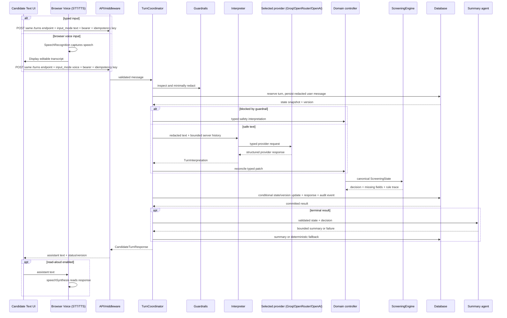

# Architecture

This service is a deliberately small modular monolith. The modules have clear seams so a provider, database, or HTTP adapter can be replaced without moving eligibility logic into a prompt. The runtime entry point is [`src/candidate_screening/main.py`](../src/candidate_screening/main.py); the domain package has no LLM or SQLAlchemy dependency.

## Components

```mermaid
flowchart TB
  subgraph Clients
    TextUI[Candidate Text UI: textarea + Send]
    VoiceControls[Candidate Voice controls]
    BrowserSTT[Browser SpeechRecognition / STT]
    BrowserTTS[Browser speechSynthesis / optional TTS]
    Recruiter[Recruiter UI / internal client]
    VoiceControls -->|spoken input| BrowserSTT
    BrowserSTT -->|interim/final transcript| TextUI
    TextUI -->|typed or edited text + input_mode| Turns["POST /api/v1/candidate/conversations/{id}/turns"]
    TextUI -->|new conversation| Create["POST /api/v1/candidate/conversations"]
    Turns -->|assistant text| TextUI
    Turns -->|optional assistant text| BrowserTTS
  end

  subgraph HTTP[FastAPI application]
    Middleware[Correlation ID + body/rate/concurrency limits]
    CandidateAPI[Candidate API]
    InternalAPI[Internal/recruiter + analytics API]
    Auth[Opaque resume token / internal bearer key]
  end

  subgraph Application[Application layer]
    Coordinator[TurnCoordinator]
    Controller[ConversationController]
    Reconcile[reconcile_interpretation]
    Guard[inspect_message + summary_is_safe]
    FAQ[FAQCatalog]
    Analytics[operational event aggregation]
    Reminder[ReengagementService]
  end

  subgraph Domain[Pure domain layer]
    State[ScreeningState]
    Rules[ScreeningEngine]
    Areas[ServiceAreaMatcher]
    Transitions[allowed status transitions]
  end

  subgraph AI[Separate server-side LLM provider boundary]
    Resolver[Configuration-driven model resolver]
    Interpreter[PydanticAIInterpreter]
    Summary[SummaryGenerator]
    Schemas[TurnInterpretation / RecruiterSummaryOutput]
    Groq[Groq / openai/gpt-oss-20b (recommended free dev)]
    OpenRouter[OpenRouter / DeepSeek V4 Flash Free (secondary free)]
    OpenAI[OpenAI / selected model (explicit opt-in)]
  end

  Groq -. server-side API .-> GroqAPI[(Groq OpenAI-compatible API)]
  OpenAI -. server-side API .-> OpenAIAPI[(OpenAI API)]
  OpenRouter -. server-side API .-> OpenRouterAPI[(OpenRouter API)]

  DB[(SQLAlchemy ORM + SQLite)]
  Data[(versioned JSON catalogue + FAQ)]

  Turns --> Middleware
  Create --> Middleware
  Recruiter --> Middleware
  Middleware --> CandidateAPI
  Middleware --> InternalAPI
  CandidateAPI --> Auth
  InternalAPI --> Auth
  CandidateAPI --> Coordinator
  InternalAPI --> Coordinator
  Coordinator --> Guard
  Guard --> Interpreter
  Resolver --> Groq
  Resolver --> OpenAI
  Resolver --> OpenRouter
  Groq --> Interpreter
  OpenAI --> Interpreter
  OpenRouter --> Interpreter
  Groq --> Summary
  OpenAI --> Summary
  OpenRouter --> Summary
  Interpreter --> Schemas
  Schemas --> Reconcile
  Reconcile --> Controller
  Controller --> Rules
  Controller --> Areas
  Coordinator --> FAQ
  FAQ --> Data
  Coordinator --> Summary
  Summary --> Guard
  Coordinator --> DB
  InternalAPI --> Analytics
  Reminder --> DB
  State --> Rules
  Transitions --> Rules
```

The candidate browser has one text composer and two optional voice adapters. Typed text, or a reviewed transcript produced by browser SpeechRecognition, is submitted to the same versioned `/turns` endpoint and enters the same coordinator/reconciliation/rules workflow; `input_mode` is provenance, not a different decision path. Assistant text is always rendered in the text UI, with optional browser `speechSynthesis` reading it aloud. Microphone audio is not sent to or persisted by this service. The separate server-side provider boundary is used only after guardrails, and Groq, OpenRouter, and OpenAI all feed the same typed interpreter contract.

### HTTP and security boundary

FastAPI exposes a versioned candidate router at `/api/v1/candidate`, a protected internal router at `/api/v1/internal`, a protected analytics endpoint at `/api/v1/internal/analytics`, and public `/healthz`, `/livez`, and `/readyz` endpoints. Unversioned aliases exist for local compatibility and are intentionally omitted from OpenAPI. Middleware adds a bounded correlation ID, rejects bodies above `MAX_BODY_BYTES`, applies a process-local rolling request limit to candidate paths, and rejects new turns when the process-local semaphore is full.

Conversation creation has no bearer credential because it creates a new session. The response contains an opaque high-entropy resume token once; the database stores only its SHA-256 hash. Candidate reads and turns require `Authorization: Bearer <resume token>`. Internal routes require a separately configured `INTERNAL_API_KEY` and compare it in constant time. A candidate token cannot be used as an internal credential.

### Application and domain boundary

`TurnCoordinator` is the transaction boundary and failure policy. It reserves a turn, persists the redacted candidate message, builds server-owned bounded history, calls the interpreter outside a database transaction, invokes `ConversationController`, and commits the resulting state with an expected version. It then records a response payload that allows an idempotent replay. The coordinator never trusts a model-provided status.

`ConversationController` delegates factual mutation to reconciliation and status evaluation to `ScreeningEngine`. Reconciliation accepts only fields explicitly supported by `TurnInterpretation`. It stores evidence with a message ID and confidence, but an existing value is not overwritten by a changed value: the proposed value is stored in `pending_confirmation` until a positive confirmation. Prompt injection and sensitive-data flags return a safe response without applying any patch.

The rule engine is pure and rerunnable. Under ruleset `2026-01`, the required fields are full name, licence, confirmed exact service area (or an explicitly confirmed set of configured areas for a known city), availability, preferred schedule, delivery experience, and start availability, followed by candidate confirmation. The only disqualification rules are an explicit negative licence answer and an unsupported service area. Missing data and uncertain locations are `in_progress`; a known city without a zone creates a `service_area_city` confirmation listing that city's configured zones, while the controller changes other ambiguous locations to `needs_review` only after its clarification bound is exhausted. A single fuzzy suggestion remains pending and answerable until explicit confirmation or rejection. An explicit opt-out is `abandoned`; a complete, confirmed state is `qualified`. `qualified`, `disqualified`, and `abandoned` are sticky through the transition table. The coordinator also closes the candidate conversation when it hands off `needs_review`, even though the domain transition table permits later internal resolution.

### AI boundary

`PydanticAIInterpreter` uses a Pydantic AI `Agent` with `TurnInterpretation` as its output type. The schema is an extraction/intent patch, not a decision schema, and rejects unknown fields. Trusted dependencies include current canonical state, pending field, active language, date, and correlation ID. Persisted history is converted to provider messages by `build_bounded_history` and limited by pair and character budgets.

The model factory is the only provider-specific construction boundary. `LLM_MODEL` uses `provider:model` syntax and currently resolves the recommended `groq:openai/gpt-oss-20b` through Groq's OpenAI-compatible API ([official compatibility reference](https://console.groq.com/docs/openai)), `openrouter:<model>` through Pydantic AI's first-class `OpenRouterModel`/`OpenRouterProvider` ([official integration](https://pydantic.dev/docs/ai/models/openrouter/)), or `openai:<model>` through OpenAI's Responses model. All three providers feed the same typed extraction and summary agents and the same coordinator. Groq is the default free development route; OpenRouter/DeepSeek is a secondary free route, and OpenAI is an explicit usage-billed choice. Provider selection is explicit and there is no cross-provider, cross-model, or paid fallback. OpenRouter is configured with no model fallback and conservative data-collection/ZDR routing settings. `OPENROUTER_REQUIRE_PARAMETERS` is configurable and defaults to `false`: strict filtering can reject free endpoints that do not advertise every optional structured-tool parameter, while Pydantic output validation remains authoritative. A free-route outage, HTTP 429, or parameter mismatch becomes a safe retryable turn failure rather than an unexpected paid request. Provider keys are selected lazily from `GROQ_API_KEY`, `OPENROUTER_API_KEY`, or `OPENAI_API_KEY`, and are never returned to the browser or written to logs.

As a dated operational reference, Groq's [rate-limit table](https://console.groq.com/docs/rate-limits) listed 30 RPM, 1,000 RPD, 8,000 TPM, and 200,000 TPD for `openai/gpt-oss-20b` on 2026-09-03. Groq describes those values as high-level Free Plan limits; the exact organization/project limits and model availability must be checked in the account console and may change. A Groq 429 is therefore handled as provider capacity/rate limiting, not as a reason to change provider. Operators should wait for the reset, respect `retry-after` when available, reduce concurrency/token volume, or make an explicit provider switch.

Groq's [data-controls reference](https://console.groq.com/docs/your-data) says inference data is not retained by default, usage metadata is always retained, and reliability/abuse logs may retain customer data for up to 30 days unless ZDR is enabled; retained customer data is stored in US GCP buckets. These are provider statements, not an application privacy guarantee. Confirm ZDR, the current [Groq DPA](https://console.groq.com/docs/legal/customer-data-processing-addendum), subprocessors, SCC/US-transfer basis, residency, retention/deletion, and legal basis before real candidate data is sent.

The summary agent is a separate typed agent. It receives JSON containing the validated state and deterministic decision, not the raw transcript. A summary is accepted only if it validates, is at most 1,200 characters, and passes the deterministic safety predicate. Any provider error or unsafe output uses `_summary_fallback`, which omits free-form evidence and raw start-date text. Summary generation is intentionally after the state commit; a slow model cannot keep a database transaction open or roll back a valid screening result. The canonical result starts as `summary_status=pending`; a transient derived-write failure is logged without failing the candidate turn, and an authenticated `POST /api/v1/internal/screenings/{session_id}/summary/retry` repairs the summary without re-running screening.

### Knowledge boundary

The FAQ is not an open-ended model knowledge source. `FAQCatalog` loads a small bilingual JSON file, accent-folds and tokenizes the candidate’s question, and returns the highest-scoring configured phrase/keyword match. It answers in the active language and then resumes the next screening prompt. No vector store, embeddings, web search, citations, or semantic retrieval are implemented. The service-area catalogue follows the same data-driven approach: exact names and aliases (including configured city aliases) are accepted, one fuzzy suggestion requires confirmation, a known city without a zone produces an explicit city-area offer, and multiple unrelated suggestions remain ambiguous.

## Turn sequence and consistency



The unique `(conversation_id, idempotency_key)` constraint and request hash prevent a retry from becoming a second turn. Replaying a completed or failed turn returns the stored response with `idempotent: true`; using the key for a different message is a conflict. The coordinator enforces `MAX_TURNS` before any additional provider call and uses a deterministic recruiter handoff at the bound. An in-process per-conversation lock reduces duplicate work, while optimistic `screening_sessions.version` checking protects the database if another worker changes the session. A conflict is reported as a safe retryable/concurrency error rather than merging model updates.

## Persistence model

The Alembic schema stores `candidates`, `screening_sessions`, `conversations`, `turns`, `messages`, `screening_results`, `audit_events`, and `recruiter_reviews`. Canonical state is JSON so the domain model can be validated and replayed; status, language, version, activity timestamps, and ruleset version have first-class columns for indexing and operations. Turns retain model name/usage and latency for operations, but candidate-facing responses contain neither provider traces nor stack traces. Audit events hold stable event names such as `turn_started`, `turn_completed`, `guardrail_blocked`, `screening_qualified`, `summary_fallback`, and `recruiter_review_recorded`.

The default SQLite URL and one Uvicorn worker are appropriate for a local/demo process. The ORM uses portable primitives and an explicit unit of work, but a multi-instance deployment still needs a managed database, shared rate limiting, a queue/worker strategy, and migration coordination. `/livez` is a static process probe. `/readyz` performs a narrow `SELECT 1` database check plus service-area/FAQ fixture parsing; it deliberately does not require an LLM provider, because provider availability is handled per turn with a safe retryable response.

## Operational jobs

`ReengagementService` is a separate application service invoked by [`scripts/reengage.py`](../scripts/reengage.py). It plans only active, still-in-progress conversations older than `INACTIVITY_HOURS`, suppresses opted-out/closed/terminal sessions and conversations at the reminder limit, and defaults to a dry run. `--apply` conditionally claims each reminder, appends the assistant message and audit event, and is safe to retry. It does not automatically mark a conversation abandoned. The `RETENTION_DAYS` setting is present for a future retention job; no deletion worker currently exists.
