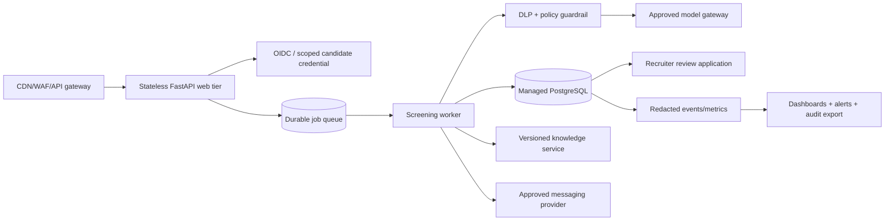

# Path to production

This repository is a controlled demo, not a production hiring system. The most important next step is not adding a more capable model; it is deciding whether the concrete use case, data flow, and human process are appropriate, then proving that decision with tests and operational evidence. The checklist below is intentionally ordered as launch gates.

## Gate 0 — product and governance decision

- Name the accountable product owner, recruiter owner, privacy owner, security owner, and incident owner.
- Write the intended purpose and prohibited uses in plain language. Keep “screening assistant” separate from ranking, recommendation, selection, performance monitoring, or autonomous rejection.
- Replace the fictional role description, service-area catalogue, and FAQ with approved, dated data. Review every explicit criterion for job relevance, necessity, accommodation, and language parity. Version criteria independently from code and keep an approval record.
- Decide the supported countries, languages, channels, workers, tenants, and provider regions. Document whether a human makes the final decision and how a candidate can ask for correction, review, or contest.
- Commission a use-case/risk assessment with qualified privacy, employment, security, accessibility, and domain reviewers. Recheck the official [European Commission AI Act overview](https://digital-strategy.ec.europa.eu/en/policies/regulatory-framework-ai), [enforcement timeline](https://digital-strategy.ec.europa.eu/en/policies/enforcement-ai-act), and [consolidated Regulation (EU) 2024/1689](https://eur-lex.europa.eu/eli/reg/2024/1689) at launch. This document is not legal advice.

The Commission timeline describes broad AI Act application and transparency/enforcement activity from 2 August 2026, while Annex III high-risk employment rules are described as applying from 2 December 2027. Those regulatory dates are an orientation point, not a classification of this system. A concrete recruitment deployment must be reviewed against the current text and implementation material.

## Gate 1 — privacy and security foundations

- Produce a data inventory and flow map for browser/channel → API → database → model provider → recruiter. Include message content, evidence quotes, model usage, request hashes, resume tokens, logs, backups, support exports, and audit events.
- Define purpose, retention, deletion, backup expiry, subject-rights intake, correction, objection, export, and appeal processes. The repository’s `RETENTION_DAYS` setting is not enforcement; add a scheduled deletion/anonymisation worker with dry run, metrics, and a tested recovery story.
- Replace one shared `INTERNAL_API_KEY` with SSO/OIDC, short-lived credentials, role-based access, tenant isolation, secret-manager storage, key rotation, break-glass controls, and access logging. Keep candidate resume tokens scoped, revocable, and rate-limited.
- Use TLS, encrypted managed storage, encrypted backups, least-privilege database roles, dependency/image scanning, secure headers, CSRF/origin strategy where applicable, and a documented provider data-processing configuration. Do not log raw candidate text, tokens, prompts, or provider secrets.
- Upgrade the heuristic guardrail to a tested DLP/policy boundary. Keep redaction before persistence/provider calls, but measure false positives/negatives and provide a safe correction path when valid names or dates are over-redacted.
- Add abuse controls at the edge: WAF/API gateway, distributed rate limiting, request quotas, bot protection, IP/device abuse signals, and an incident playbook. The current middleware counters and locks are process-local.

## Gate 2 — dependable workflow and data layer

- Move shared production state from SQLite to a managed PostgreSQL-compatible service. Keep Alembic migrations explicit, reviewed, reversible where possible, and run them as a release step rather than implicitly on every web process start.
- Introduce a queue and worker for provider interpretation, retries, summary generation, and outbound reminders. Preserve the current invariant: no database transaction is held open while waiting on a model. The normal interpretation job is LLM-first; a valid neutral/empty structured result may use the narrow deterministic completion path, while provider failures remain retryable failures rather than semantic fallback. Add timeouts, exponential backoff, circuit breaking, dead-letter handling, and any provider failover policy only with explicit cost, privacy, and human-approval controls.
- Replace process-local conversation locks with a distributed coordination strategy. Retain the unique idempotency constraint, request fingerprint, optimistic version, and stored response replay; add contract tests across multiple workers.
- Make terminal transitions, correction proposals, review decisions, opt-outs, and deletion events append-only/auditable without exposing raw sensitive data. Add a safe replay tool that recomputes a decision from a pinned state/ruleset and clearly labels differences after a rules change.
- Keep `/readyz` as a narrow database-plus-fixture dependency check and `/livez` independent so an unhealthy database does not create a restart loop. Add graceful shutdown and queue draining.
- Treat reminders as an outbound communications product: explicit channel consent/permissions, delivery provider, locale templates, quiet hours, bounce/complaint handling, opt-out propagation, and a shared claim/idempotency key. The current worker only queues an assistant message in the database and never marks a session abandoned automatically.

## Gate 3 — model, knowledge, and evaluation quality

- Keep `TurnInterpretation` as a patch schema and `ScreeningEngine` as the only eligibility owner. Reject unknown fields, invalid enums, unsupported dates, missing evidence, low confidence, and model outputs that attempt status/rule changes.
- Pin model/provider versions and prompts; store a non-sensitive model identifier and usage metadata; create a change log and rollback path. Do not send the transcript to the summary agent unless a reviewed use case requires it.
- Treat every hosted route as an explicit, reviewed deployment choice. The current recommended free development route is Groq `openai/gpt-oss-20b`; verify its organization/project RPM, RPD, TPM, and TPD limits, model lifecycle, structured-output behavior, retention, residency, and processor terms at each release. The reviewed secondary OpenRouter route is the pinned `z-ai/glm-5.2:free`; verify the model page, native strict JSON contract, reasoning behavior, current quota, endpoint/quantization, downstream retention, residency, and processor terms at each release. OpenRouter documents free limits of 20 RPM and 50 RPD, or 1,000 RPD after at least $10 of lifetime credits; treat them as volatile references, not guarantees. Other `openrouter:<model-id>` values are explicit expert overrides and require their own review. OpenAI remains an explicit usage-billed option. Do not add silent fallback from a free model to another model or a paid model; define any production failover policy with separate cost, privacy, and human-approval controls.
- Expand the deterministic fixture set into a versioned, consented, de-identified test corpus. Include spelling, accents, code-switching, colloquialisms, short/long answers, multi-fact answers, dates/time zones, corrections, ambiguous areas, accessibility accommodations, unsupported questions, adversarial prompts, and provider/schema failures.
- Measure field-level precision/recall, abstention and clarification rates, false disqualification, terminal-status error, latency, cost, retry rate, provider-attempt rate, valid-but-insufficient output rate, deterministic-completion rate, provider-failure rate, summary fallback rate, guardrail blocks, and candidate drop-off. Define release thresholds and inspect slices by permitted audit dimensions without using those dimensions in eligibility.
- Run shadow/replay tests against a pinned ruleset before every criteria or model change. Separate model extraction regressions from business-rule changes. Require human sign-off for any ruleset version change.
- Add a governed knowledge pipeline before semantic retrieval: owner, source, effective date, citation, locale, answer policy, stale-answer alert, retrieval precision test, and human fallback. The current lexical FAQ is safer precisely because its boundary is small; a vector/RAG layer should not be added without those controls.
- Run red-team tests for prompt injection, data exfiltration, tool misuse, Unicode/markup tricks, model-generated PII, and summary invention. Confirm blocked content cannot change language, pending corrections, state, or status.

## Gate 4 — human experience and accessibility

- Replace the demo disclosure with an approved, accessible, channel-specific notice and privacy information. Make the automated nature, purpose, categories of data, recruiter review, opt-out, correction route, and support contact easy to understand in every language.
- Build recruiter workflows for queue assignment, reason/rule inspection, pending confirmations, evidence review, corrections, escalation, candidate contact, review SLA, and appeal. Add role permissions and a clear distinction between fact correction and final employment action.
- Test keyboard navigation, screen readers, contrast, mobile layout, slow connections, timeouts, retries, browser storage loss, duplicate clicks, right-to-left or additional language requirements, and communication differences. Do not make speed, spelling, sentiment, or language confidence a hiring criterion.
- Add a candidate-facing way to resume, revoke the token, request a human, correct a field, and see what was recorded. Keep terminal messages respectful and criterion-specific; never imply a guaranteed job outcome.

## Gate 5 — operations, deployment, and evidence

- Use a managed runtime with at least two stateless web instances, shared database/queue/cache, autoscaling limits, and a tested rollback. Keep containers non-root and minimal as the current Dockerfile does; sign images and scan them before release.
- Export structured logs, traces, and metrics with correlation IDs. Redact content at the logger boundary. Preserve interpretation provenance and provider-reported usage separately from deterministic completion counters. Alert on provider failures, queue age, latency, database errors, optimistic conflicts, guardrail spikes, summary fallback rate, reminder complaints, and review backlog.
- Run synthetic health journeys in both languages, migration smoke tests, backup/restore drills, provider outage drills, key rotation, dependency upgrades, and disaster-recovery exercises. Define RTO/RPO and capacity limits.
- Keep CI deterministic and cheap. Continue running format/lint/typecheck/pytest/migrations/Docker smoke tests on every change. Keep live evaluations manual, allowlisted, secrets-scoped, and gated by explicit operator approval; this workflow cannot cap provider billing, so enforce spend with a provider/project quota. Publish run IDs, model version, corpus version, cost, and pass/fail evidence without candidate data.
- Maintain an audit package: approved criteria/ruleset, model/provider configuration, data-flow map, test and fairness reports, human-review procedure, incidents, release approvals, migration history, and deletion/rights evidence.

## Suggested target architecture

The target keeps the same core design: LLM-first typed extraction, narrow deterministic completion when a valid response is insufficient, deterministic reconciliation/rules, human review, and replayable state. The new pieces solve shared coordination, identity, outbound delivery, retention, and operations rather than moving decisions into a bigger prompt. Guardrails, exact opt-out, explicit UI language events, and turn-limit enforcement remain provider-free controls; an unavailable provider is not disguised as a successful local interpretation.

## Explicit “do not ship yet” list

Do not use the bundled catalogue or FAQ as real policy. Do not use `qualified` as an automatic hire/reject action. Do not infer or collect protected characteristics for decisioning. Do not assume `RETENTION_DAYS` deletes anything. Do not run multiple production workers against the default SQLite file. Do not expose `/recruiter` with a shared demo key. Do not enable live evaluations without a secret and approved spend. Do not treat the deterministic 24-case suite as evidence of fairness, accuracy, or legal compliance.
