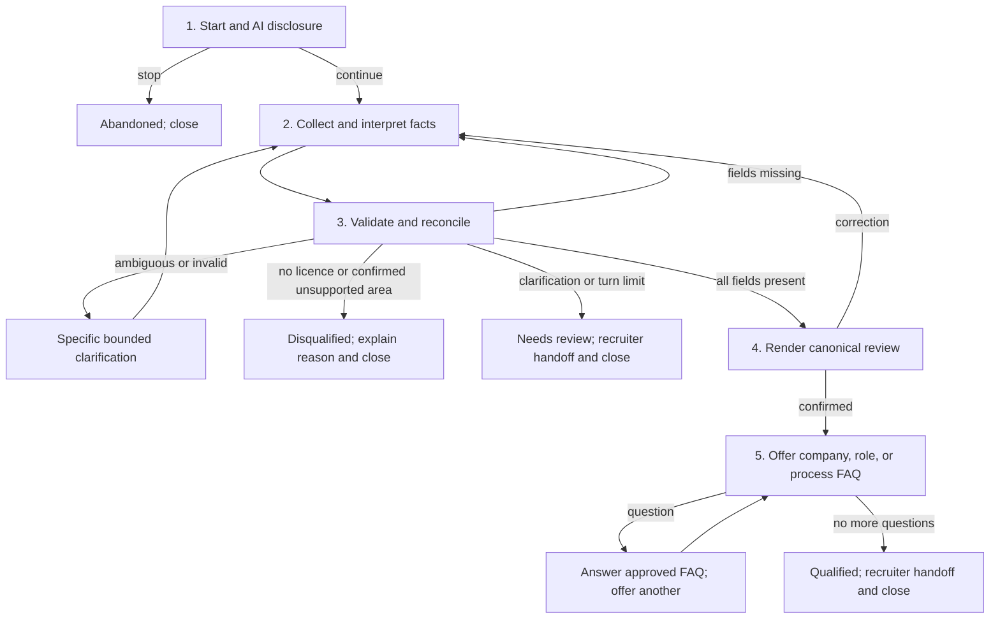

# Candidate screening process design

## Purpose and control boundary

Olivia is a disclosed automated assistant for a fictional delivery-driver role. It
collects approved job facts, answers a bounded FAQ, and hands results to a recruiter. It
does not rank candidates, infer protected characteristics, score personality/sentiment,
or make subjective employment decisions.

The LLM interprets natural Spanish/English messages into a strict typed patch. Python
owns schema validation, evidence grounding, corrections, service-area matching,
qualification, state transitions, persistence, and handoff. Canonical `ScreeningState`,
not the transcript, is the source of truth. Ruleset `2026-01` uses only licence and
service-area membership as deterministic disqualifiers.

## Conversation stages and branching

1. **Start and disclosure.** `POST /api/v1/candidate/conversations` creates the
   candidate, screening session, active conversation, first AI disclosure, and opaque
   resume token. The candidate can continue, switch ES/EN, ask a question, or opt out.
2. **Interpret each turn.** Guardrails redact/block sensitive or injection-like content
   before provider work. A normal safe turn uses the configured Pydantic AI interpreter
   first with canonical state, the pending goal, current date, and bounded server-built
   history. Its `TurnInterpretation` may contain several evidenced facts, a correction,
   confirmation, language change, opt-out, or candidate question; it cannot contain a
   screening status.
3. **Validate and reconcile.** The application grounds evidence to the latest message,
   may narrowly complete a schema-valid neutral response with obvious controls/catalogue
   values, validates locations against the configured catalogue, protects existing facts
   behind confirmation, and runs `ScreeningEngine`. Already-known fields are skipped.
4. **Review.** Once all required facts exist, Olivia prints the actual canonical values.
   A correction reopens collection and resets confirmation. Agreement moves to the FAQ
   phase; it does not yet close an otherwise-qualified conversation.
5. **Questions and completion.** Supported company, role, schedule, equipment,
   onboarding, requirements, document, safety, location, and process questions are
   answered from the fictional bilingual FAQ. The current screening goal is preserved
   during earlier FAQ interruptions. After review, Olivia keeps offering another question
   until the candidate explicitly says there are none; only then is `qualified` terminal.

Fields are normally requested in this order, but one message can fill several:

`full_name → drivers_license → location → availability → preferred_schedule → delivery_experience → start_availability → canonical review → FAQ completion`

## Data fields and validation rules

| Field | Accepted canonical value | Validation and decision effect |
| --- | --- | --- |
| Full name | Non-empty candidate-provided name | Required and evidence-grounded; never used to infer protected traits. |
| Driver's licence | Boolean | Required. Explicit `false` deterministically yields `no_drivers_license`; ambiguity is clarified. |
| City/service area | Catalogue-backed location | Required. Exact/alias match is accepted. City-only, fuzzy, or model-proposed decision-impacting values require confirmation. Confirmed unsupported coverage yields `outside_service_area`. The LLM cannot invent an area. |
| Availability | One or more of `full_time`, `part_time`, `weekends` | Required enum interpreted from natural ES/EN wording; no option is itself a disqualifier. |
| Preferred schedule | `morning`, `afternoon`, `evening`, `flexible` | Required enum; unclear values are clarified and do not affect eligibility until valid. |
| Delivery experience | Non-negative years; optional platforms | Years are required. Experience is recorded but is not a disqualifier in this ruleset. |
| Start availability | Candidate wording, optional date, precision `exact`/`asap`/`week`/`month` | Required. Actionable periods such as “next week” or “as soon as possible” are valid; `unknown` remains unresolved. |
| Candidate confirmation | Boolean over the displayed canonical review | Required before FAQ completion; any factual update resets it. |

Pydantic owns structural validation, reconciliation owns safe updates, the service-area
catalogue owns coverage, and `ScreeningEngine` alone owns status/reason codes.

## Outcome paths

| Outcome | What the candidate sees | What is persisted / handed off |
| --- | --- | --- |
| `qualified` | The stated requirements are met and a recruiter will review; no job promise | Completed conversation, `all_explicit_criteria_met`, rule trace, generated/safe-fallback summary, `handoff_status=ready` |
| `disqualified` | Respectful close naming only the approved licence or configured-area reason | Completed conversation, exact reason code and rule trace; normally no recruiter handoff required |
| `needs_review` | The unresolved detail will be reviewed by a recruiter; not a rejection | Closed candidate conversation, trusted state and uncertainty retained, handoff ready |
| `abandoned` | Confirmation that screening is closed | `opted_out`; re-engagement suppressed |
| `in_progress` | One focused prompt, clarification, confirmation, or FAQ bridge | Active/resumable state and version; no terminal outcome claimed |

Summaries are generated only after a terminal decision and receive validated state plus
the deterministic rule result—not the transcript. Unsafe/invalid provider output becomes
a factual fallback summary without changing qualification.

## Edge-case contract

| Edge case | Behavior |
| --- | --- |
| Several facts in one message | Extract/validate all evidenced facts; ask only for the next missing field. |
| Ambiguous, partial, or invalid value | Say what relevant detail was understood and ask a field-specific clarification. Never label semantic uncertainty as a provider outage. |
| Correction or contradiction | Hold the proposal in `pending_confirmation`; apply/discard after yes/no and re-run rules. |
| Repeated misunderstanding | Increment the field counter; after the configured bound, close as `needs_review` rather than loop. |
| FAQ before/during screening | Ground the latest explicit question, answer only an approved match, then resume the same pending goal. Unsupported questions get an honest fallback. |
| Off-topic/social filler | Reply briefly and return to the pending goal; do not become a general assistant. |
| Prompt injection | Block before the model, preserve state, record a security event, and continue safely. |
| Sensitive/contact data | Redact/block before persistence/provider work; never use it in qualification or summary. |
| ES/EN switch or code-switching | Change wording when explicit/sufficiently clear; keep canonical state and rules unchanged. |
| City only, fuzzy, or unknown area | List configured areas or ask confirmation; never guess. Echo the interpreted area in a rejection. |
| Duplicate/retried request | Same idempotency key and message replays the stored response; key reuse with different content conflicts. |
| Concurrent turn | Optimistic versioning rejects the conflict instead of merging uncertain patches. |
| Provider timeout, 429, invalid output, or outage | Apply bounded provider-specific retries, keep the typing state visible, preserve canonical state, and return a temporary message naming the pending field. Never silently switch to a paid provider. |
| Candidate stops responding | Keep the session resumable and `in_progress`; bounded dry-run re-engagement excludes terminal/opted-out sessions. |
| Resume later | Resume token loads persisted messages, canonical state, and current goal; the transcript is not reparsed. |
| Turn limit | Close as `needs_review` without another provider request. |
| Message after terminal state | Reject it; terminal statuses are sticky. |

Turn reservation and state commits are short database transactions; provider latency does
not hold a transaction open. Failures use correlation IDs and never expose stack traces,
prompts, or credentials. Details are in [architecture.md](architecture.md).

## Message tone and length guidelines

This is messaging, not email:

- use one or two short paragraphs and normally one clear question/action per reply;
- be warm, concise, informal-but-professional, and natural in the active language;
- acknowledge useful information briefly without praising every answer or dumping the
  full record outside final review;
- name the unresolved field and relevant understood value instead of repeating a generic
  apology or demanding exact enum wording;
- answer an approved FAQ briefly, then bridge naturally back to the pending goal;
- keep the AI identity visible in the introduction/header without repeating it each turn;
- avoid email greetings/sign-offs, bureaucratic prose, excessive enthusiasm, emojis,
  sentiment judgments, or claims that the candidate is hired; and
- keep privacy, security, disqualification, and provider-failure wording semantically
  exact; ordinary prompts may use small deterministic, test-controlled variants.

All criteria, service areas, FAQ content, and candidate copy are demo fixtures and require
business, privacy, employment, accessibility, and legal review before real deployment.
